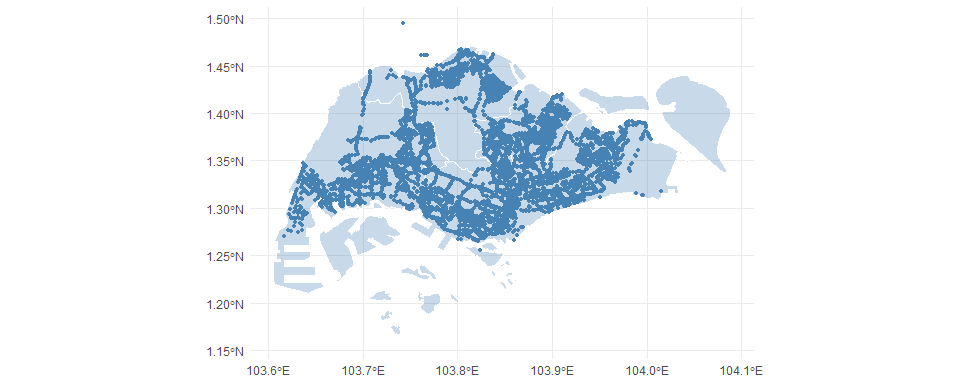
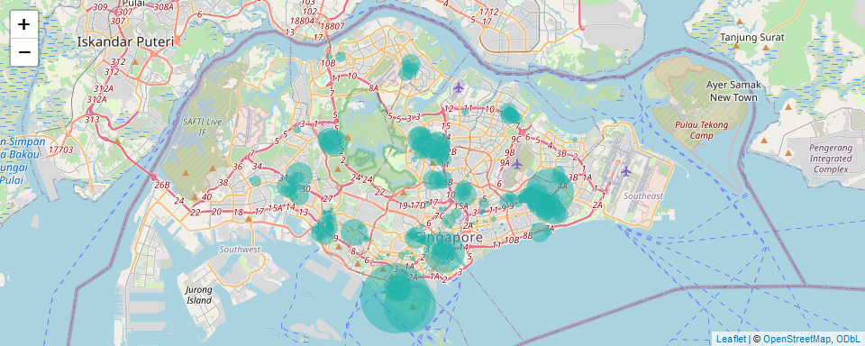

Workshop 6
================
YH
2024-02-20

- [Location of bus stops in
  Singapore](#location-of-bus-stops-in-singapore)
- [Real-time Carpark Availability](#real-time-carpark-availability)

## Location of bus stops in Singapore

In the first workshop, we will create a data map of the location of bus
stops in Singapore. We will need two pieces of information:

- The **shapefile** for geographical boundaries are available from
  [data.gov.sg](https://beta.data.gov.sg/collections/1717/view).
  Download and store it in the data directory.

- The **shapefile** for bus stop locations is available as one of [LTA’s
  static data
  sets](https://datamall.lta.gov.sg/content/datamall/en/static-data.html).
  We can download and unzip the file with `R`.

``` r
# Download and unzip the LTA shapefile.
download.file("https://datamall.lta.gov.sg/content/dam/datamall/datasets/Geospatial/BusStopLocation.zip",
              destfile="../data/BusStopLocation.zip")
unzip("../data/BusStopLocation.zip", exdir = "../data/")
```

Now we are ready to recreate the map on bus stops.

``` r
library(sf)
library(tidyverse)
busstop <- st_read("../data/BusStopLocation_Jul2023/BusStop.shp")
```

    ## Reading layer `BusStop' from data source 
    ##   `C:\Users\yhuang\Desktop\DSE3101\workshops\06-workshop\data\BusStopLocation_Jul2023\BusStop.shp' 
    ##   using driver `ESRI Shapefile'
    ## Simple feature collection with 5161 features and 3 fields
    ## Geometry type: POINT
    ## Dimension:     XY
    ## Bounding box:  xmin: 3970.122 ymin: 26482.1 xmax: 48284.56 ymax: 52983.82
    ## Projected CRS: SVY21

``` r
planningarea <- st_read("../data/MasterPlan2019RegionBoundaryNoSeaGEOJSON.geojson")
```

    ## Reading layer `MasterPlan2019RegionBoundaryNoSeaGEOJSON' from data source 
    ##   `C:\Users\yhuang\Desktop\DSE3101\workshops\06-workshop\data\MasterPlan2019RegionBoundaryNoSeaGEOJSON.geojson' 
    ##   using driver `GeoJSON'
    ## Simple feature collection with 5 features and 2 fields
    ## Geometry type: MULTIPOLYGON
    ## Dimension:     XYZ
    ## Bounding box:  xmin: 103.6057 ymin: 1.158699 xmax: 104.0885 ymax: 1.470775
    ## z_range:       zmin: 0 zmax: 0
    ## Geodetic CRS:  WGS 84

``` r
ggplot(data = planningarea) +
  geom_sf(aes(geometry = geometry), fill = "steelblue", alpha = 0.3, color = "white") +
  geom_sf(data = busstop, aes(geometry = geometry), size = 1, color = "steelblue") +
  theme_minimal()
```

<!-- -->

## Real-time Carpark Availability

Let’s visualize the carpark availability data from LTA.

``` r
library(httr); library(jsonlite)
# Construct the resource URL
resource_url <- "http://datamall2.mytransport.sg/ltaodataservice/CarParkAvailabilityv2"
# Make the GET() request
res <- GET(resource_url, 
           add_headers(AccountKey = Sys.getenv("LTA_KEY"),
                       accept = "application/json"))
# Parse the returned data
res_content <- content(res, as = "text")
res_list <- fromJSON(res_content, flatten = TRUE)
# Extract information from sub-list
df_carpark <- as_tibble(res_list$value)
head(df_carpark)
```

<div class="kable-table">

| CarParkID | Area   | Development        | Location          | AvailableLots | LotType | Agency |
|:----------|:-------|:-------------------|:------------------|--------------:|:--------|:-------|
| 1         | Marina | Suntec City        | 1.29375 103.85718 |           551 | C       | LTA    |
| 2         | Marina | Marina Square      | 1.29115 103.85728 |          1156 | C       | LTA    |
| 3         | Marina | Raffles City       | 1.29382 103.85319 |           388 | C       | LTA    |
| 4         | Marina | The Esplanade      | 1.29011 103.85561 |           585 | C       | LTA    |
| 5         | Marina | Millenia Singapore | 1.29251 103.86009 |           412 | C       | LTA    |
| 6         | Marina | Singapore Flyer    | 1.28944 103.86311 |           230 | C       | LTA    |

</div>

``` r
# Extract information from sublist
df_carpark <- as_tibble(res_list$value) %>%
  separate(Location, into = c("lat", "long"), sep = " ", convert = TRUE)
```

``` r
library(leaflet)
leaflet(df_carpark) %>%
  addTiles() %>%
  addCircleMarkers(lng = ~long, lat = ~lat,
             popup = ~paste0("Available slots: ", AvailableLots),
             radius = ~AvailableLots/50, stroke = FALSE, fillOpacity = 0.5, color = "lightseagreen")
```

<!-- -->
