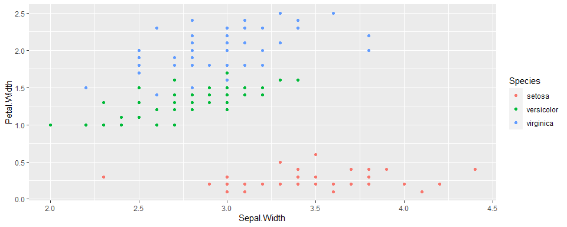

## Interactive visualizations

So far, we've been creating static plots in `R`. Now let's move to interactive visuals.

We will use two packages: `plotly` and `leaflet`.


```r
# install.packages(c("plotly", leaflet"))
library(plotly)
library(leaflet)
library(tidyverse)
```

### `plotly` scatter plot

`plotly` is a software that provides open-source APIs for creating interactive visualizations. It is available in `R`, `python`, Matlab, and Javascript.

With the package loaded, we can convert `ggplot` objects easily into interactive graphics.

Let's start from a static plot.


```r
data(iris)
p1 <- ggplot(data =iris,aes(x =Sepal.Width,y =Petal.Width,color =Species)) +
  geom_point()
p1
```

<!-- -->

Convert it into interactive visual.


```r
ggplotly(p1)
```

```{=html}
<div class="plotly html-widget html-fill-item" id="htmlwidget-c527246816ce8c8217af" style="width:960px;height:384px;"></div>
<script type="application/json" data-for="htmlwidget-c527246816ce8c8217af">{"x":{"data":[{"x":[3.5,3,3.2000000000000002,3.1000000000000001,3.6000000000000001,3.8999999999999999,3.3999999999999999,3.3999999999999999,2.8999999999999999,3.1000000000000001,3.7000000000000002,3.3999999999999999,3,3,4,4.4000000000000004,3.8999999999999999,3.5,3.7999999999999998,3.7999999999999998,3.3999999999999999,3.7000000000000002,3.6000000000000001,3.2999999999999998,3.3999999999999999,3,3.3999999999999999,3.5,3.3999999999999999,3.2000000000000002,3.1000000000000001,3.3999999999999999,4.0999999999999996,4.2000000000000002,3.1000000000000001,3.2000000000000002,3.5,3.6000000000000001,3,3.3999999999999999,3.5,2.2999999999999998,3.2000000000000002,3.5,3.7999999999999998,3,3.7999999999999998,3.2000000000000002,3.7000000000000002,3.2999999999999998],"y":[0.20000000000000001,0.20000000000000001,0.20000000000000001,0.20000000000000001,0.20000000000000001,0.40000000000000002,0.29999999999999999,0.20000000000000001,0.20000000000000001,0.10000000000000001,0.20000000000000001,0.20000000000000001,0.10000000000000001,0.10000000000000001,0.20000000000000001,0.40000000000000002,0.40000000000000002,0.29999999999999999,0.29999999999999999,0.29999999999999999,0.20000000000000001,0.40000000000000002,0.20000000000000001,0.5,0.20000000000000001,0.20000000000000001,0.40000000000000002,0.20000000000000001,0.20000000000000001,0.20000000000000001,0.20000000000000001,0.40000000000000002,0.10000000000000001,0.20000000000000001,0.20000000000000001,0.20000000000000001,0.20000000000000001,0.10000000000000001,0.20000000000000001,0.20000000000000001,0.29999999999999999,0.29999999999999999,0.20000000000000001,0.59999999999999998,0.40000000000000002,0.29999999999999999,0.20000000000000001,0.20000000000000001,0.20000000000000001,0.20000000000000001],"text":["Sepal.Width: 3.5<br />Petal.Width: 0.2<br />Species: setosa","Sepal.Width: 3.0<br />Petal.Width: 0.2<br />Species: setosa","Sepal.Width: 3.2<br />Petal.Width: 0.2<br />Species: setosa","Sepal.Width: 3.1<br />Petal.Width: 0.2<br />Species: setosa","Sepal.Width: 3.6<br />Petal.Width: 0.2<br />Species: setosa","Sepal.Width: 3.9<br />Petal.Width: 0.4<br />Species: setosa","Sepal.Width: 3.4<br />Petal.Width: 0.3<br />Species: setosa","Sepal.Width: 3.4<br />Petal.Width: 0.2<br />Species: setosa","Sepal.Width: 2.9<br />Petal.Width: 0.2<br />Species: setosa","Sepal.Width: 3.1<br />Petal.Width: 0.1<br />Species: setosa","Sepal.Width: 3.7<br />Petal.Width: 0.2<br />Species: setosa","Sepal.Width: 3.4<br />Petal.Width: 0.2<br />Species: setosa","Sepal.Width: 3.0<br />Petal.Width: 0.1<br />Species: setosa","Sepal.Width: 3.0<br />Petal.Width: 0.1<br />Species: setosa","Sepal.Width: 4.0<br />Petal.Width: 0.2<br />Species: setosa","Sepal.Width: 4.4<br />Petal.Width: 0.4<br />Species: setosa","Sepal.Width: 3.9<br />Petal.Width: 0.4<br />Species: setosa","Sepal.Width: 3.5<br />Petal.Width: 0.3<br />Species: setosa","Sepal.Width: 3.8<br />Petal.Width: 0.3<br />Species: setosa","Sepal.Width: 3.8<br />Petal.Width: 0.3<br />Species: setosa","Sepal.Width: 3.4<br />Petal.Width: 0.2<br />Species: setosa","Sepal.Width: 3.7<br />Petal.Width: 0.4<br />Species: setosa","Sepal.Width: 3.6<br />Petal.Width: 0.2<br />Species: setosa","Sepal.Width: 3.3<br />Petal.Width: 0.5<br />Species: setosa","Sepal.Width: 3.4<br />Petal.Width: 0.2<br />Species: setosa","Sepal.Width: 3.0<br />Petal.Width: 0.2<br />Species: setosa","Sepal.Width: 3.4<br />Petal.Width: 0.4<br />Species: setosa","Sepal.Width: 3.5<br />Petal.Width: 0.2<br />Species: setosa","Sepal.Width: 3.4<br />Petal.Width: 0.2<br />Species: setosa","Sepal.Width: 3.2<br />Petal.Width: 0.2<br />Species: setosa","Sepal.Width: 3.1<br />Petal.Width: 0.2<br />Species: setosa","Sepal.Width: 3.4<br />Petal.Width: 0.4<br />Species: setosa","Sepal.Width: 4.1<br />Petal.Width: 0.1<br />Species: setosa","Sepal.Width: 4.2<br />Petal.Width: 0.2<br />Species: setosa","Sepal.Width: 3.1<br />Petal.Width: 0.2<br />Species: setosa","Sepal.Width: 3.2<br />Petal.Width: 0.2<br />Species: setosa","Sepal.Width: 3.5<br />Petal.Width: 0.2<br />Species: setosa","Sepal.Width: 3.6<br />Petal.Width: 0.1<br />Species: setosa","Sepal.Width: 3.0<br />Petal.Width: 0.2<br />Species: setosa","Sepal.Width: 3.4<br />Petal.Width: 0.2<br />Species: setosa","Sepal.Width: 3.5<br />Petal.Width: 0.3<br />Species: setosa","Sepal.Width: 2.3<br />Petal.Width: 0.3<br />Species: setosa","Sepal.Width: 3.2<br />Petal.Width: 0.2<br />Species: setosa","Sepal.Width: 3.5<br />Petal.Width: 0.6<br />Species: setosa","Sepal.Width: 3.8<br />Petal.Width: 0.4<br />Species: setosa","Sepal.Width: 3.0<br />Petal.Width: 0.3<br />Species: setosa","Sepal.Width: 3.8<br />Petal.Width: 0.2<br />Species: setosa","Sepal.Width: 3.2<br />Petal.Width: 0.2<br />Species: setosa","Sepal.Width: 3.7<br />Petal.Width: 0.2<br />Species: setosa","Sepal.Width: 3.3<br />Petal.Width: 0.2<br />Species: setosa"],"type":"scatter","mode":"markers","marker":{"autocolorscale":false,"color":"rgba(248,118,109,1)","opacity":1,"size":5.6692913385826778,"symbol":"circle","line":{"width":1.8897637795275593,"color":"rgba(248,118,109,1)"}},"hoveron":"points","name":"setosa","legendgroup":"setosa","showlegend":true,"xaxis":"x","yaxis":"y","hoverinfo":"text","frame":null},{"x":[3.2000000000000002,3.2000000000000002,3.1000000000000001,2.2999999999999998,2.7999999999999998,2.7999999999999998,3.2999999999999998,2.3999999999999999,2.8999999999999999,2.7000000000000002,2,3,2.2000000000000002,2.8999999999999999,2.8999999999999999,3.1000000000000001,3,2.7000000000000002,2.2000000000000002,2.5,3.2000000000000002,2.7999999999999998,2.5,2.7999999999999998,2.8999999999999999,3,2.7999999999999998,3,2.8999999999999999,2.6000000000000001,2.3999999999999999,2.3999999999999999,2.7000000000000002,2.7000000000000002,3,3.3999999999999999,3.1000000000000001,2.2999999999999998,3,2.5,2.6000000000000001,3,2.6000000000000001,2.2999999999999998,2.7000000000000002,3,2.8999999999999999,2.8999999999999999,2.5,2.7999999999999998],"y":[1.3999999999999999,1.5,1.5,1.3,1.5,1.3,1.6000000000000001,1,1.3,1.3999999999999999,1,1.5,1,1.3999999999999999,1.3,1.3999999999999999,1.5,1,1.5,1.1000000000000001,1.8,1.3,1.5,1.2,1.3,1.3999999999999999,1.3999999999999999,1.7,1.5,1,1.1000000000000001,1,1.2,1.6000000000000001,1.5,1.6000000000000001,1.5,1.3,1.3,1.3,1.2,1.3999999999999999,1.2,1,1.3,1.2,1.3,1.3,1.1000000000000001,1.3],"text":["Sepal.Width: 3.2<br />Petal.Width: 1.4<br />Species: versicolor","Sepal.Width: 3.2<br />Petal.Width: 1.5<br />Species: versicolor","Sepal.Width: 3.1<br />Petal.Width: 1.5<br />Species: versicolor","Sepal.Width: 2.3<br />Petal.Width: 1.3<br />Species: versicolor","Sepal.Width: 2.8<br />Petal.Width: 1.5<br />Species: versicolor","Sepal.Width: 2.8<br />Petal.Width: 1.3<br />Species: versicolor","Sepal.Width: 3.3<br />Petal.Width: 1.6<br />Species: versicolor","Sepal.Width: 2.4<br />Petal.Width: 1.0<br />Species: versicolor","Sepal.Width: 2.9<br />Petal.Width: 1.3<br />Species: versicolor","Sepal.Width: 2.7<br />Petal.Width: 1.4<br />Species: versicolor","Sepal.Width: 2.0<br />Petal.Width: 1.0<br />Species: versicolor","Sepal.Width: 3.0<br />Petal.Width: 1.5<br />Species: versicolor","Sepal.Width: 2.2<br />Petal.Width: 1.0<br />Species: versicolor","Sepal.Width: 2.9<br />Petal.Width: 1.4<br />Species: versicolor","Sepal.Width: 2.9<br />Petal.Width: 1.3<br />Species: versicolor","Sepal.Width: 3.1<br />Petal.Width: 1.4<br />Species: versicolor","Sepal.Width: 3.0<br />Petal.Width: 1.5<br />Species: versicolor","Sepal.Width: 2.7<br />Petal.Width: 1.0<br />Species: versicolor","Sepal.Width: 2.2<br />Petal.Width: 1.5<br />Species: versicolor","Sepal.Width: 2.5<br />Petal.Width: 1.1<br />Species: versicolor","Sepal.Width: 3.2<br />Petal.Width: 1.8<br />Species: versicolor","Sepal.Width: 2.8<br />Petal.Width: 1.3<br />Species: versicolor","Sepal.Width: 2.5<br />Petal.Width: 1.5<br />Species: versicolor","Sepal.Width: 2.8<br />Petal.Width: 1.2<br />Species: versicolor","Sepal.Width: 2.9<br />Petal.Width: 1.3<br />Species: versicolor","Sepal.Width: 3.0<br />Petal.Width: 1.4<br />Species: versicolor","Sepal.Width: 2.8<br />Petal.Width: 1.4<br />Species: versicolor","Sepal.Width: 3.0<br />Petal.Width: 1.7<br />Species: versicolor","Sepal.Width: 2.9<br />Petal.Width: 1.5<br />Species: versicolor","Sepal.Width: 2.6<br />Petal.Width: 1.0<br />Species: versicolor","Sepal.Width: 2.4<br />Petal.Width: 1.1<br />Species: versicolor","Sepal.Width: 2.4<br />Petal.Width: 1.0<br />Species: versicolor","Sepal.Width: 2.7<br />Petal.Width: 1.2<br />Species: versicolor","Sepal.Width: 2.7<br />Petal.Width: 1.6<br />Species: versicolor","Sepal.Width: 3.0<br />Petal.Width: 1.5<br />Species: versicolor","Sepal.Width: 3.4<br />Petal.Width: 1.6<br />Species: versicolor","Sepal.Width: 3.1<br />Petal.Width: 1.5<br />Species: versicolor","Sepal.Width: 2.3<br />Petal.Width: 1.3<br />Species: versicolor","Sepal.Width: 3.0<br />Petal.Width: 1.3<br />Species: versicolor","Sepal.Width: 2.5<br />Petal.Width: 1.3<br />Species: versicolor","Sepal.Width: 2.6<br />Petal.Width: 1.2<br />Species: versicolor","Sepal.Width: 3.0<br />Petal.Width: 1.4<br />Species: versicolor","Sepal.Width: 2.6<br />Petal.Width: 1.2<br />Species: versicolor","Sepal.Width: 2.3<br />Petal.Width: 1.0<br />Species: versicolor","Sepal.Width: 2.7<br />Petal.Width: 1.3<br />Species: versicolor","Sepal.Width: 3.0<br />Petal.Width: 1.2<br />Species: versicolor","Sepal.Width: 2.9<br />Petal.Width: 1.3<br />Species: versicolor","Sepal.Width: 2.9<br />Petal.Width: 1.3<br />Species: versicolor","Sepal.Width: 2.5<br />Petal.Width: 1.1<br />Species: versicolor","Sepal.Width: 2.8<br />Petal.Width: 1.3<br />Species: versicolor"],"type":"scatter","mode":"markers","marker":{"autocolorscale":false,"color":"rgba(0,186,56,1)","opacity":1,"size":5.6692913385826778,"symbol":"circle","line":{"width":1.8897637795275593,"color":"rgba(0,186,56,1)"}},"hoveron":"points","name":"versicolor","legendgroup":"versicolor","showlegend":true,"xaxis":"x","yaxis":"y","hoverinfo":"text","frame":null},{"x":[3.2999999999999998,2.7000000000000002,3,2.8999999999999999,3,3,2.5,2.8999999999999999,2.5,3.6000000000000001,3.2000000000000002,2.7000000000000002,3,2.5,2.7999999999999998,3.2000000000000002,3,3.7999999999999998,2.6000000000000001,2.2000000000000002,3.2000000000000002,2.7999999999999998,2.7999999999999998,2.7000000000000002,3.2999999999999998,3.2000000000000002,2.7999999999999998,3,2.7999999999999998,3,2.7999999999999998,3.7999999999999998,2.7999999999999998,2.7999999999999998,2.6000000000000001,3,3.3999999999999999,3.1000000000000001,3,3.1000000000000001,3.1000000000000001,3.1000000000000001,2.7000000000000002,3.2000000000000002,3.2999999999999998,3,2.5,3,3.3999999999999999,3],"y":[2.5,1.8999999999999999,2.1000000000000001,1.8,2.2000000000000002,2.1000000000000001,1.7,1.8,1.8,2.5,2,1.8999999999999999,2.1000000000000001,2,2.3999999999999999,2.2999999999999998,1.8,2.2000000000000002,2.2999999999999998,1.5,2.2999999999999998,2,2,1.8,2.1000000000000001,1.8,1.8,1.8,2.1000000000000001,1.6000000000000001,1.8999999999999999,2,2.2000000000000002,1.5,1.3999999999999999,2.2999999999999998,2.3999999999999999,1.8,1.8,2.1000000000000001,2.3999999999999999,2.2999999999999998,1.8999999999999999,2.2999999999999998,2.5,2.2999999999999998,1.8999999999999999,2,2.2999999999999998,1.8],"text":["Sepal.Width: 3.3<br />Petal.Width: 2.5<br />Species: virginica","Sepal.Width: 2.7<br />Petal.Width: 1.9<br />Species: virginica","Sepal.Width: 3.0<br />Petal.Width: 2.1<br />Species: virginica","Sepal.Width: 2.9<br />Petal.Width: 1.8<br />Species: virginica","Sepal.Width: 3.0<br />Petal.Width: 2.2<br />Species: virginica","Sepal.Width: 3.0<br />Petal.Width: 2.1<br />Species: virginica","Sepal.Width: 2.5<br />Petal.Width: 1.7<br />Species: virginica","Sepal.Width: 2.9<br />Petal.Width: 1.8<br />Species: virginica","Sepal.Width: 2.5<br />Petal.Width: 1.8<br />Species: virginica","Sepal.Width: 3.6<br />Petal.Width: 2.5<br />Species: virginica","Sepal.Width: 3.2<br />Petal.Width: 2.0<br />Species: virginica","Sepal.Width: 2.7<br />Petal.Width: 1.9<br />Species: virginica","Sepal.Width: 3.0<br />Petal.Width: 2.1<br />Species: virginica","Sepal.Width: 2.5<br />Petal.Width: 2.0<br />Species: virginica","Sepal.Width: 2.8<br />Petal.Width: 2.4<br />Species: virginica","Sepal.Width: 3.2<br />Petal.Width: 2.3<br />Species: virginica","Sepal.Width: 3.0<br />Petal.Width: 1.8<br />Species: virginica","Sepal.Width: 3.8<br />Petal.Width: 2.2<br />Species: virginica","Sepal.Width: 2.6<br />Petal.Width: 2.3<br />Species: virginica","Sepal.Width: 2.2<br />Petal.Width: 1.5<br />Species: virginica","Sepal.Width: 3.2<br />Petal.Width: 2.3<br />Species: virginica","Sepal.Width: 2.8<br />Petal.Width: 2.0<br />Species: virginica","Sepal.Width: 2.8<br />Petal.Width: 2.0<br />Species: virginica","Sepal.Width: 2.7<br />Petal.Width: 1.8<br />Species: virginica","Sepal.Width: 3.3<br />Petal.Width: 2.1<br />Species: virginica","Sepal.Width: 3.2<br />Petal.Width: 1.8<br />Species: virginica","Sepal.Width: 2.8<br />Petal.Width: 1.8<br />Species: virginica","Sepal.Width: 3.0<br />Petal.Width: 1.8<br />Species: virginica","Sepal.Width: 2.8<br />Petal.Width: 2.1<br />Species: virginica","Sepal.Width: 3.0<br />Petal.Width: 1.6<br />Species: virginica","Sepal.Width: 2.8<br />Petal.Width: 1.9<br />Species: virginica","Sepal.Width: 3.8<br />Petal.Width: 2.0<br />Species: virginica","Sepal.Width: 2.8<br />Petal.Width: 2.2<br />Species: virginica","Sepal.Width: 2.8<br />Petal.Width: 1.5<br />Species: virginica","Sepal.Width: 2.6<br />Petal.Width: 1.4<br />Species: virginica","Sepal.Width: 3.0<br />Petal.Width: 2.3<br />Species: virginica","Sepal.Width: 3.4<br />Petal.Width: 2.4<br />Species: virginica","Sepal.Width: 3.1<br />Petal.Width: 1.8<br />Species: virginica","Sepal.Width: 3.0<br />Petal.Width: 1.8<br />Species: virginica","Sepal.Width: 3.1<br />Petal.Width: 2.1<br />Species: virginica","Sepal.Width: 3.1<br />Petal.Width: 2.4<br />Species: virginica","Sepal.Width: 3.1<br />Petal.Width: 2.3<br />Species: virginica","Sepal.Width: 2.7<br />Petal.Width: 1.9<br />Species: virginica","Sepal.Width: 3.2<br />Petal.Width: 2.3<br />Species: virginica","Sepal.Width: 3.3<br />Petal.Width: 2.5<br />Species: virginica","Sepal.Width: 3.0<br />Petal.Width: 2.3<br />Species: virginica","Sepal.Width: 2.5<br />Petal.Width: 1.9<br />Species: virginica","Sepal.Width: 3.0<br />Petal.Width: 2.0<br />Species: virginica","Sepal.Width: 3.4<br />Petal.Width: 2.3<br />Species: virginica","Sepal.Width: 3.0<br />Petal.Width: 1.8<br />Species: virginica"],"type":"scatter","mode":"markers","marker":{"autocolorscale":false,"color":"rgba(97,156,255,1)","opacity":1,"size":5.6692913385826778,"symbol":"circle","line":{"width":1.8897637795275593,"color":"rgba(97,156,255,1)"}},"hoveron":"points","name":"virginica","legendgroup":"virginica","showlegend":true,"xaxis":"x","yaxis":"y","hoverinfo":"text","frame":null}],"layout":{"margin":{"t":34.264840182648406,"r":7.3059360730593621,"b":48.219178082191803,"l":43.105022831050235},"plot_bgcolor":"rgba(235,235,235,1)","paper_bgcolor":"rgba(255,255,255,1)","font":{"color":"rgba(0,0,0,1)","family":"","size":14.611872146118724},"xaxis":{"domain":[0,1],"automargin":true,"type":"linear","autorange":false,"range":[1.8799999999999999,4.5200000000000005],"tickmode":"array","ticktext":["2.0","2.5","3.0","3.5","4.0","4.5"],"tickvals":[2,2.5,3,3.5,4,4.5],"categoryorder":"array","categoryarray":["2.0","2.5","3.0","3.5","4.0","4.5"],"nticks":null,"ticks":"outside","tickcolor":"rgba(51,51,51,1)","ticklen":3.6529680365296811,"tickwidth":0.66417600664176002,"showticklabels":true,"tickfont":{"color":"rgba(77,77,77,1)","family":"","size":11.689497716894984},"tickangle":-0,"showline":false,"linecolor":null,"linewidth":0,"showgrid":true,"gridcolor":"rgba(255,255,255,1)","gridwidth":0.66417600664176002,"zeroline":false,"anchor":"y","title":{"text":"Sepal.Width","font":{"color":"rgba(0,0,0,1)","family":"","size":14.611872146118724}},"hoverformat":".2f"},"yaxis":{"domain":[0,1],"automargin":true,"type":"linear","autorange":false,"range":[-0.01999999999999999,2.6200000000000001],"tickmode":"array","ticktext":["0.0","0.5","1.0","1.5","2.0","2.5"],"tickvals":[0,0.5,1,1.4999999999999998,2,2.5],"categoryorder":"array","categoryarray":["0.0","0.5","1.0","1.5","2.0","2.5"],"nticks":null,"ticks":"outside","tickcolor":"rgba(51,51,51,1)","ticklen":3.6529680365296811,"tickwidth":0.66417600664176002,"showticklabels":true,"tickfont":{"color":"rgba(77,77,77,1)","family":"","size":11.68949771689498},"tickangle":-0,"showline":false,"linecolor":null,"linewidth":0,"showgrid":true,"gridcolor":"rgba(255,255,255,1)","gridwidth":0.66417600664176002,"zeroline":false,"anchor":"x","title":{"text":"Petal.Width","font":{"color":"rgba(0,0,0,1)","family":"","size":14.611872146118724}},"hoverformat":".2f"},"shapes":[{"type":"rect","fillcolor":null,"line":{"color":null,"width":0,"linetype":[]},"yref":"paper","xref":"paper","x0":0,"x1":1,"y0":0,"y1":1}],"showlegend":true,"legend":{"bgcolor":"rgba(255,255,255,1)","bordercolor":"transparent","borderwidth":1.8897637795275593,"font":{"color":"rgba(0,0,0,1)","family":"","size":11.689497716894984},"title":{"text":"Species","font":{"color":"rgba(0,0,0,1)","family":"","size":14.611872146118724}}},"hovermode":"closest","barmode":"relative"},"config":{"doubleClick":"reset","modeBarButtonsToAdd":["hoverclosest","hovercompare"],"showSendToCloud":false},"source":"A","attrs":{"6414788a20fe":{"x":{},"y":{},"colour":{},"type":"scatter"}},"cur_data":"6414788a20fe","visdat":{"6414788a20fe":["function (y) ","x"]},"highlight":{"on":"plotly_click","persistent":false,"dynamic":false,"selectize":false,"opacityDim":0.20000000000000001,"selected":{"opacity":1},"debounce":0},"shinyEvents":["plotly_hover","plotly_click","plotly_selected","plotly_relayout","plotly_brushed","plotly_brushing","plotly_clickannotation","plotly_doubleclick","plotly_deselect","plotly_afterplot","plotly_sunburstclick"],"base_url":"https://plot.ly"},"evals":[],"jsHooks":[]}</script>
```

We can also use `plotly`'s own function, `plot_ly()` to build interactive graphics.


```r
plot_ly(
  data = iris,
  x = ~Sepal.Width, y = ~Petal.Width, color = ~Species,
  type = "scatter", # Specify the type of plot to create
  mode = "markers" # Determine the drawing mode for the scatter (point markers)
) %>%
  layout(
    title = "Iris data set visualization",
    xaxis = list(title = "Sepal width", ticksuffix = "cm"),
    yaxis = list(title = "Petal width", ticksuffix = "cm")
  )
```

```{=html}
<div class="plotly html-widget html-fill-item" id="htmlwidget-41fa9cf12addef7e812e" style="width:960px;height:384px;"></div>
<script type="application/json" data-for="htmlwidget-41fa9cf12addef7e812e">{"x":{"visdat":{"64146ce5745a":["function () ","plotlyVisDat"]},"cur_data":"64146ce5745a","attrs":{"64146ce5745a":{"x":{},"y":{},"mode":"markers","color":{},"alpha_stroke":1,"sizes":[10,100],"spans":[1,20],"type":"scatter"}},"layout":{"margin":{"b":40,"l":60,"t":25,"r":10},"title":"Iris data set visualization","xaxis":{"domain":[0,1],"automargin":true,"title":"Sepal width","ticksuffix":"cm"},"yaxis":{"domain":[0,1],"automargin":true,"title":"Petal width","ticksuffix":"cm"},"hovermode":"closest","showlegend":true},"source":"A","config":{"modeBarButtonsToAdd":["hoverclosest","hovercompare"],"showSendToCloud":false},"data":[{"x":[3.5,3,3.2000000000000002,3.1000000000000001,3.6000000000000001,3.8999999999999999,3.3999999999999999,3.3999999999999999,2.8999999999999999,3.1000000000000001,3.7000000000000002,3.3999999999999999,3,3,4,4.4000000000000004,3.8999999999999999,3.5,3.7999999999999998,3.7999999999999998,3.3999999999999999,3.7000000000000002,3.6000000000000001,3.2999999999999998,3.3999999999999999,3,3.3999999999999999,3.5,3.3999999999999999,3.2000000000000002,3.1000000000000001,3.3999999999999999,4.0999999999999996,4.2000000000000002,3.1000000000000001,3.2000000000000002,3.5,3.6000000000000001,3,3.3999999999999999,3.5,2.2999999999999998,3.2000000000000002,3.5,3.7999999999999998,3,3.7999999999999998,3.2000000000000002,3.7000000000000002,3.2999999999999998],"y":[0.20000000000000001,0.20000000000000001,0.20000000000000001,0.20000000000000001,0.20000000000000001,0.40000000000000002,0.29999999999999999,0.20000000000000001,0.20000000000000001,0.10000000000000001,0.20000000000000001,0.20000000000000001,0.10000000000000001,0.10000000000000001,0.20000000000000001,0.40000000000000002,0.40000000000000002,0.29999999999999999,0.29999999999999999,0.29999999999999999,0.20000000000000001,0.40000000000000002,0.20000000000000001,0.5,0.20000000000000001,0.20000000000000001,0.40000000000000002,0.20000000000000001,0.20000000000000001,0.20000000000000001,0.20000000000000001,0.40000000000000002,0.10000000000000001,0.20000000000000001,0.20000000000000001,0.20000000000000001,0.20000000000000001,0.10000000000000001,0.20000000000000001,0.20000000000000001,0.29999999999999999,0.29999999999999999,0.20000000000000001,0.59999999999999998,0.40000000000000002,0.29999999999999999,0.20000000000000001,0.20000000000000001,0.20000000000000001,0.20000000000000001],"mode":"markers","type":"scatter","name":"setosa","marker":{"color":"rgba(102,194,165,1)","line":{"color":"rgba(102,194,165,1)"}},"textfont":{"color":"rgba(102,194,165,1)"},"error_y":{"color":"rgba(102,194,165,1)"},"error_x":{"color":"rgba(102,194,165,1)"},"line":{"color":"rgba(102,194,165,1)"},"xaxis":"x","yaxis":"y","frame":null},{"x":[3.2000000000000002,3.2000000000000002,3.1000000000000001,2.2999999999999998,2.7999999999999998,2.7999999999999998,3.2999999999999998,2.3999999999999999,2.8999999999999999,2.7000000000000002,2,3,2.2000000000000002,2.8999999999999999,2.8999999999999999,3.1000000000000001,3,2.7000000000000002,2.2000000000000002,2.5,3.2000000000000002,2.7999999999999998,2.5,2.7999999999999998,2.8999999999999999,3,2.7999999999999998,3,2.8999999999999999,2.6000000000000001,2.3999999999999999,2.3999999999999999,2.7000000000000002,2.7000000000000002,3,3.3999999999999999,3.1000000000000001,2.2999999999999998,3,2.5,2.6000000000000001,3,2.6000000000000001,2.2999999999999998,2.7000000000000002,3,2.8999999999999999,2.8999999999999999,2.5,2.7999999999999998],"y":[1.3999999999999999,1.5,1.5,1.3,1.5,1.3,1.6000000000000001,1,1.3,1.3999999999999999,1,1.5,1,1.3999999999999999,1.3,1.3999999999999999,1.5,1,1.5,1.1000000000000001,1.8,1.3,1.5,1.2,1.3,1.3999999999999999,1.3999999999999999,1.7,1.5,1,1.1000000000000001,1,1.2,1.6000000000000001,1.5,1.6000000000000001,1.5,1.3,1.3,1.3,1.2,1.3999999999999999,1.2,1,1.3,1.2,1.3,1.3,1.1000000000000001,1.3],"mode":"markers","type":"scatter","name":"versicolor","marker":{"color":"rgba(252,141,98,1)","line":{"color":"rgba(252,141,98,1)"}},"textfont":{"color":"rgba(252,141,98,1)"},"error_y":{"color":"rgba(252,141,98,1)"},"error_x":{"color":"rgba(252,141,98,1)"},"line":{"color":"rgba(252,141,98,1)"},"xaxis":"x","yaxis":"y","frame":null},{"x":[3.2999999999999998,2.7000000000000002,3,2.8999999999999999,3,3,2.5,2.8999999999999999,2.5,3.6000000000000001,3.2000000000000002,2.7000000000000002,3,2.5,2.7999999999999998,3.2000000000000002,3,3.7999999999999998,2.6000000000000001,2.2000000000000002,3.2000000000000002,2.7999999999999998,2.7999999999999998,2.7000000000000002,3.2999999999999998,3.2000000000000002,2.7999999999999998,3,2.7999999999999998,3,2.7999999999999998,3.7999999999999998,2.7999999999999998,2.7999999999999998,2.6000000000000001,3,3.3999999999999999,3.1000000000000001,3,3.1000000000000001,3.1000000000000001,3.1000000000000001,2.7000000000000002,3.2000000000000002,3.2999999999999998,3,2.5,3,3.3999999999999999,3],"y":[2.5,1.8999999999999999,2.1000000000000001,1.8,2.2000000000000002,2.1000000000000001,1.7,1.8,1.8,2.5,2,1.8999999999999999,2.1000000000000001,2,2.3999999999999999,2.2999999999999998,1.8,2.2000000000000002,2.2999999999999998,1.5,2.2999999999999998,2,2,1.8,2.1000000000000001,1.8,1.8,1.8,2.1000000000000001,1.6000000000000001,1.8999999999999999,2,2.2000000000000002,1.5,1.3999999999999999,2.2999999999999998,2.3999999999999999,1.8,1.8,2.1000000000000001,2.3999999999999999,2.2999999999999998,1.8999999999999999,2.2999999999999998,2.5,2.2999999999999998,1.8999999999999999,2,2.2999999999999998,1.8],"mode":"markers","type":"scatter","name":"virginica","marker":{"color":"rgba(141,160,203,1)","line":{"color":"rgba(141,160,203,1)"}},"textfont":{"color":"rgba(141,160,203,1)"},"error_y":{"color":"rgba(141,160,203,1)"},"error_x":{"color":"rgba(141,160,203,1)"},"line":{"color":"rgba(141,160,203,1)"},"xaxis":"x","yaxis":"y","frame":null}],"highlight":{"on":"plotly_click","persistent":false,"dynamic":false,"selectize":false,"opacityDim":0.20000000000000001,"selected":{"opacity":1},"debounce":0},"shinyEvents":["plotly_hover","plotly_click","plotly_selected","plotly_relayout","plotly_brushed","plotly_brushing","plotly_clickannotation","plotly_doubleclick","plotly_deselect","plotly_afterplot","plotly_sunburstclick"],"base_url":"https://plot.ly"},"evals":[],"jsHooks":[]}</script>
```

Here is a 3D scatter plot by `plot_ly()`.


```r
plot_ly(
  data = iris, 
  x= ~Sepal.Length, y= ~Sepal.Width, z= ~Petal.Length, color = ~Species,
  type = "scatter3d",
  mode = "markers") 
```

```{=html}
<div class="plotly html-widget html-fill-item" id="htmlwidget-f745990e08b47b448dd6" style="width:960px;height:384px;"></div>
<script type="application/json" data-for="htmlwidget-f745990e08b47b448dd6">{"x":{"visdat":{"6414757461dd":["function () ","plotlyVisDat"]},"cur_data":"6414757461dd","attrs":{"6414757461dd":{"x":{},"y":{},"z":{},"mode":"markers","color":{},"alpha_stroke":1,"sizes":[10,100],"spans":[1,20],"type":"scatter3d"}},"layout":{"margin":{"b":40,"l":60,"t":25,"r":10},"scene":{"xaxis":{"title":"Sepal.Length"},"yaxis":{"title":"Sepal.Width"},"zaxis":{"title":"Petal.Length"}},"hovermode":"closest","showlegend":true},"source":"A","config":{"modeBarButtonsToAdd":["hoverclosest","hovercompare"],"showSendToCloud":false},"data":[{"x":[5.0999999999999996,4.9000000000000004,4.7000000000000002,4.5999999999999996,5,5.4000000000000004,4.5999999999999996,5,4.4000000000000004,4.9000000000000004,5.4000000000000004,4.7999999999999998,4.7999999999999998,4.2999999999999998,5.7999999999999998,5.7000000000000002,5.4000000000000004,5.0999999999999996,5.7000000000000002,5.0999999999999996,5.4000000000000004,5.0999999999999996,4.5999999999999996,5.0999999999999996,4.7999999999999998,5,5,5.2000000000000002,5.2000000000000002,4.7000000000000002,4.7999999999999998,5.4000000000000004,5.2000000000000002,5.5,4.9000000000000004,5,5.5,4.9000000000000004,4.4000000000000004,5.0999999999999996,5,4.5,4.4000000000000004,5,5.0999999999999996,4.7999999999999998,5.0999999999999996,4.5999999999999996,5.2999999999999998,5],"y":[3.5,3,3.2000000000000002,3.1000000000000001,3.6000000000000001,3.8999999999999999,3.3999999999999999,3.3999999999999999,2.8999999999999999,3.1000000000000001,3.7000000000000002,3.3999999999999999,3,3,4,4.4000000000000004,3.8999999999999999,3.5,3.7999999999999998,3.7999999999999998,3.3999999999999999,3.7000000000000002,3.6000000000000001,3.2999999999999998,3.3999999999999999,3,3.3999999999999999,3.5,3.3999999999999999,3.2000000000000002,3.1000000000000001,3.3999999999999999,4.0999999999999996,4.2000000000000002,3.1000000000000001,3.2000000000000002,3.5,3.6000000000000001,3,3.3999999999999999,3.5,2.2999999999999998,3.2000000000000002,3.5,3.7999999999999998,3,3.7999999999999998,3.2000000000000002,3.7000000000000002,3.2999999999999998],"z":[1.3999999999999999,1.3999999999999999,1.3,1.5,1.3999999999999999,1.7,1.3999999999999999,1.5,1.3999999999999999,1.5,1.5,1.6000000000000001,1.3999999999999999,1.1000000000000001,1.2,1.5,1.3,1.3999999999999999,1.7,1.5,1.7,1.5,1,1.7,1.8999999999999999,1.6000000000000001,1.6000000000000001,1.5,1.3999999999999999,1.6000000000000001,1.6000000000000001,1.5,1.5,1.3999999999999999,1.5,1.2,1.3,1.3999999999999999,1.3,1.5,1.3,1.3,1.3,1.6000000000000001,1.8999999999999999,1.3999999999999999,1.6000000000000001,1.3999999999999999,1.5,1.3999999999999999],"mode":"markers","type":"scatter3d","name":"setosa","marker":{"color":"rgba(102,194,165,1)","line":{"color":"rgba(102,194,165,1)"}},"textfont":{"color":"rgba(102,194,165,1)"},"error_y":{"color":"rgba(102,194,165,1)"},"error_x":{"color":"rgba(102,194,165,1)"},"line":{"color":"rgba(102,194,165,1)"},"frame":null},{"x":[7,6.4000000000000004,6.9000000000000004,5.5,6.5,5.7000000000000002,6.2999999999999998,4.9000000000000004,6.5999999999999996,5.2000000000000002,5,5.9000000000000004,6,6.0999999999999996,5.5999999999999996,6.7000000000000002,5.5999999999999996,5.7999999999999998,6.2000000000000002,5.5999999999999996,5.9000000000000004,6.0999999999999996,6.2999999999999998,6.0999999999999996,6.4000000000000004,6.5999999999999996,6.7999999999999998,6.7000000000000002,6,5.7000000000000002,5.5,5.5,5.7999999999999998,6,5.4000000000000004,6,6.7000000000000002,6.2999999999999998,5.5999999999999996,5.5,5.5,6.0999999999999996,5.7999999999999998,5,5.5999999999999996,5.7000000000000002,5.7000000000000002,6.2000000000000002,5.0999999999999996,5.7000000000000002],"y":[3.2000000000000002,3.2000000000000002,3.1000000000000001,2.2999999999999998,2.7999999999999998,2.7999999999999998,3.2999999999999998,2.3999999999999999,2.8999999999999999,2.7000000000000002,2,3,2.2000000000000002,2.8999999999999999,2.8999999999999999,3.1000000000000001,3,2.7000000000000002,2.2000000000000002,2.5,3.2000000000000002,2.7999999999999998,2.5,2.7999999999999998,2.8999999999999999,3,2.7999999999999998,3,2.8999999999999999,2.6000000000000001,2.3999999999999999,2.3999999999999999,2.7000000000000002,2.7000000000000002,3,3.3999999999999999,3.1000000000000001,2.2999999999999998,3,2.5,2.6000000000000001,3,2.6000000000000001,2.2999999999999998,2.7000000000000002,3,2.8999999999999999,2.8999999999999999,2.5,2.7999999999999998],"z":[4.7000000000000002,4.5,4.9000000000000004,4,4.5999999999999996,4.5,4.7000000000000002,3.2999999999999998,4.5999999999999996,3.8999999999999999,3.5,4.2000000000000002,4,4.7000000000000002,3.6000000000000001,4.4000000000000004,4.5,4.0999999999999996,4.5,3.8999999999999999,4.7999999999999998,4,4.9000000000000004,4.7000000000000002,4.2999999999999998,4.4000000000000004,4.7999999999999998,5,4.5,3.5,3.7999999999999998,3.7000000000000002,3.8999999999999999,5.0999999999999996,4.5,4.5,4.7000000000000002,4.4000000000000004,4.0999999999999996,4,4.4000000000000004,4.5999999999999996,4,3.2999999999999998,4.2000000000000002,4.2000000000000002,4.2000000000000002,4.2999999999999998,3,4.0999999999999996],"mode":"markers","type":"scatter3d","name":"versicolor","marker":{"color":"rgba(252,141,98,1)","line":{"color":"rgba(252,141,98,1)"}},"textfont":{"color":"rgba(252,141,98,1)"},"error_y":{"color":"rgba(252,141,98,1)"},"error_x":{"color":"rgba(252,141,98,1)"},"line":{"color":"rgba(252,141,98,1)"},"frame":null},{"x":[6.2999999999999998,5.7999999999999998,7.0999999999999996,6.2999999999999998,6.5,7.5999999999999996,4.9000000000000004,7.2999999999999998,6.7000000000000002,7.2000000000000002,6.5,6.4000000000000004,6.7999999999999998,5.7000000000000002,5.7999999999999998,6.4000000000000004,6.5,7.7000000000000002,7.7000000000000002,6,6.9000000000000004,5.5999999999999996,7.7000000000000002,6.2999999999999998,6.7000000000000002,7.2000000000000002,6.2000000000000002,6.0999999999999996,6.4000000000000004,7.2000000000000002,7.4000000000000004,7.9000000000000004,6.4000000000000004,6.2999999999999998,6.0999999999999996,7.7000000000000002,6.2999999999999998,6.4000000000000004,6,6.9000000000000004,6.7000000000000002,6.9000000000000004,5.7999999999999998,6.7999999999999998,6.7000000000000002,6.7000000000000002,6.2999999999999998,6.5,6.2000000000000002,5.9000000000000004],"y":[3.2999999999999998,2.7000000000000002,3,2.8999999999999999,3,3,2.5,2.8999999999999999,2.5,3.6000000000000001,3.2000000000000002,2.7000000000000002,3,2.5,2.7999999999999998,3.2000000000000002,3,3.7999999999999998,2.6000000000000001,2.2000000000000002,3.2000000000000002,2.7999999999999998,2.7999999999999998,2.7000000000000002,3.2999999999999998,3.2000000000000002,2.7999999999999998,3,2.7999999999999998,3,2.7999999999999998,3.7999999999999998,2.7999999999999998,2.7999999999999998,2.6000000000000001,3,3.3999999999999999,3.1000000000000001,3,3.1000000000000001,3.1000000000000001,3.1000000000000001,2.7000000000000002,3.2000000000000002,3.2999999999999998,3,2.5,3,3.3999999999999999,3],"z":[6,5.0999999999999996,5.9000000000000004,5.5999999999999996,5.7999999999999998,6.5999999999999996,4.5,6.2999999999999998,5.7999999999999998,6.0999999999999996,5.0999999999999996,5.2999999999999998,5.5,5,5.0999999999999996,5.2999999999999998,5.5,6.7000000000000002,6.9000000000000004,5,5.7000000000000002,4.9000000000000004,6.7000000000000002,4.9000000000000004,5.7000000000000002,6,4.7999999999999998,4.9000000000000004,5.5999999999999996,5.7999999999999998,6.0999999999999996,6.4000000000000004,5.5999999999999996,5.0999999999999996,5.5999999999999996,6.0999999999999996,5.5999999999999996,5.5,4.7999999999999998,5.4000000000000004,5.5999999999999996,5.0999999999999996,5.0999999999999996,5.9000000000000004,5.7000000000000002,5.2000000000000002,5,5.2000000000000002,5.4000000000000004,5.0999999999999996],"mode":"markers","type":"scatter3d","name":"virginica","marker":{"color":"rgba(141,160,203,1)","line":{"color":"rgba(141,160,203,1)"}},"textfont":{"color":"rgba(141,160,203,1)"},"error_y":{"color":"rgba(141,160,203,1)"},"error_x":{"color":"rgba(141,160,203,1)"},"line":{"color":"rgba(141,160,203,1)"},"frame":null}],"highlight":{"on":"plotly_click","persistent":false,"dynamic":false,"selectize":false,"opacityDim":0.20000000000000001,"selected":{"opacity":1},"debounce":0},"shinyEvents":["plotly_hover","plotly_click","plotly_selected","plotly_relayout","plotly_brushed","plotly_brushing","plotly_clickannotation","plotly_doubleclick","plotly_deselect","plotly_afterplot","plotly_sunburstclick"],"base_url":"https://plot.ly"},"evals":[],"jsHooks":[]}</script>
```

### `plotly` time series plot

For visualization of multiple time series, it is useful to include annotations or hover tools.

Let's create a static plot on `psavert`, personal savings rate, and `unemploy`, the number of unemployed in thousands.


```r
data(economics_long)
economics_long %>%
  filter(variable %in% c("psavert", "uempmed")) %>%
  ggplot(aes(x = date, y = value, color = variable)) +
  geom_line(lwd = 1) +
  theme_minimal()
```

<!-- -->

An interactive plot with hover tools:


```r
df <- economics_long %>%
  filter(variable %in% c("psavert", "uempmed"))
plot_ly(
  data = df, 
  x= ~date, y= ~value, color = ~variable,
  type = "scatter",
  mode = "lines") %>%
  # Unified hovermode
  layout(hovermode = "x unified")
```

```{=html}
<div class="plotly html-widget html-fill-item" id="htmlwidget-fe5165e651d3e399b47b" style="width:960px;height:384px;"></div>
<script type="application/json" data-for="htmlwidget-fe5165e651d3e399b47b">{"x":{"visdat":{"6414412755e8":["function () ","plotlyVisDat"]},"cur_data":"6414412755e8","attrs":{"6414412755e8":{"x":{},"y":{},"mode":"lines","color":{},"alpha_stroke":1,"sizes":[10,100],"spans":[1,20],"type":"scatter"}},"layout":{"margin":{"b":40,"l":60,"t":25,"r":10},"hovermode":"x unified","xaxis":{"domain":[0,1],"automargin":true,"title":"date"},"yaxis":{"domain":[0,1],"automargin":true,"title":"value"},"showlegend":true},"source":"A","config":{"modeBarButtonsToAdd":["hoverclosest","hovercompare"],"showSendToCloud":false},"data":[{"x":["1967-07-01","1967-08-01","1967-09-01","1967-10-01","1967-11-01","1967-12-01","1968-01-01","1968-02-01","1968-03-01","1968-04-01","1968-05-01","1968-06-01","1968-07-01","1968-08-01","1968-09-01","1968-10-01","1968-11-01","1968-12-01","1969-01-01","1969-02-01","1969-03-01","1969-04-01","1969-05-01","1969-06-01","1969-07-01","1969-08-01","1969-09-01","1969-10-01","1969-11-01","1969-12-01","1970-01-01","1970-02-01","1970-03-01","1970-04-01","1970-05-01","1970-06-01","1970-07-01","1970-08-01","1970-09-01","1970-10-01","1970-11-01","1970-12-01","1971-01-01","1971-02-01","1971-03-01","1971-04-01","1971-05-01","1971-06-01","1971-07-01","1971-08-01","1971-09-01","1971-10-01","1971-11-01","1971-12-01","1972-01-01","1972-02-01","1972-03-01","1972-04-01","1972-05-01","1972-06-01","1972-07-01","1972-08-01","1972-09-01","1972-10-01","1972-11-01","1972-12-01","1973-01-01","1973-02-01","1973-03-01","1973-04-01","1973-05-01","1973-06-01","1973-07-01","1973-08-01","1973-09-01","1973-10-01","1973-11-01","1973-12-01","1974-01-01","1974-02-01","1974-03-01","1974-04-01","1974-05-01","1974-06-01","1974-07-01","1974-08-01","1974-09-01","1974-10-01","1974-11-01","1974-12-01","1975-01-01","1975-02-01","1975-03-01","1975-04-01","1975-05-01","1975-06-01","1975-07-01","1975-08-01","1975-09-01","1975-10-01","1975-11-01","1975-12-01","1976-01-01","1976-02-01","1976-03-01","1976-04-01","1976-05-01","1976-06-01","1976-07-01","1976-08-01","1976-09-01","1976-10-01","1976-11-01","1976-12-01","1977-01-01","1977-02-01","1977-03-01","1977-04-01","1977-05-01","1977-06-01","1977-07-01","1977-08-01","1977-09-01","1977-10-01","1977-11-01","1977-12-01","1978-01-01","1978-02-01","1978-03-01","1978-04-01","1978-05-01","1978-06-01","1978-07-01","1978-08-01","1978-09-01","1978-10-01","1978-11-01","1978-12-01","1979-01-01","1979-02-01","1979-03-01","1979-04-01","1979-05-01","1979-06-01","1979-07-01","1979-08-01","1979-09-01","1979-10-01","1979-11-01","1979-12-01","1980-01-01","1980-02-01","1980-03-01","1980-04-01","1980-05-01","1980-06-01","1980-07-01","1980-08-01","1980-09-01","1980-10-01","1980-11-01","1980-12-01","1981-01-01","1981-02-01","1981-03-01","1981-04-01","1981-05-01","1981-06-01","1981-07-01","1981-08-01","1981-09-01","1981-10-01","1981-11-01","1981-12-01","1982-01-01","1982-02-01","1982-03-01","1982-04-01","1982-05-01","1982-06-01","1982-07-01","1982-08-01","1982-09-01","1982-10-01","1982-11-01","1982-12-01","1983-01-01","1983-02-01","1983-03-01","1983-04-01","1983-05-01","1983-06-01","1983-07-01","1983-08-01","1983-09-01","1983-10-01","1983-11-01","1983-12-01","1984-01-01","1984-02-01","1984-03-01","1984-04-01","1984-05-01","1984-06-01","1984-07-01","1984-08-01","1984-09-01","1984-10-01","1984-11-01","1984-12-01","1985-01-01","1985-02-01","1985-03-01","1985-04-01","1985-05-01","1985-06-01","1985-07-01","1985-08-01","1985-09-01","1985-10-01","1985-11-01","1985-12-01","1986-01-01","1986-02-01","1986-03-01","1986-04-01","1986-05-01","1986-06-01","1986-07-01","1986-08-01","1986-09-01","1986-10-01","1986-11-01","1986-12-01","1987-01-01","1987-02-01","1987-03-01","1987-04-01","1987-05-01","1987-06-01","1987-07-01","1987-08-01","1987-09-01","1987-10-01","1987-11-01","1987-12-01","1988-01-01","1988-02-01","1988-03-01","1988-04-01","1988-05-01","1988-06-01","1988-07-01","1988-08-01","1988-09-01","1988-10-01","1988-11-01","1988-12-01","1989-01-01","1989-02-01","1989-03-01","1989-04-01","1989-05-01","1989-06-01","1989-07-01","1989-08-01","1989-09-01","1989-10-01","1989-11-01","1989-12-01","1990-01-01","1990-02-01","1990-03-01","1990-04-01","1990-05-01","1990-06-01","1990-07-01","1990-08-01","1990-09-01","1990-10-01","1990-11-01","1990-12-01","1991-01-01","1991-02-01","1991-03-01","1991-04-01","1991-05-01","1991-06-01","1991-07-01","1991-08-01","1991-09-01","1991-10-01","1991-11-01","1991-12-01","1992-01-01","1992-02-01","1992-03-01","1992-04-01","1992-05-01","1992-06-01","1992-07-01","1992-08-01","1992-09-01","1992-10-01","1992-11-01","1992-12-01","1993-01-01","1993-02-01","1993-03-01","1993-04-01","1993-05-01","1993-06-01","1993-07-01","1993-08-01","1993-09-01","1993-10-01","1993-11-01","1993-12-01","1994-01-01","1994-02-01","1994-03-01","1994-04-01","1994-05-01","1994-06-01","1994-07-01","1994-08-01","1994-09-01","1994-10-01","1994-11-01","1994-12-01","1995-01-01","1995-02-01","1995-03-01","1995-04-01","1995-05-01","1995-06-01","1995-07-01","1995-08-01","1995-09-01","1995-10-01","1995-11-01","1995-12-01","1996-01-01","1996-02-01","1996-03-01","1996-04-01","1996-05-01","1996-06-01","1996-07-01","1996-08-01","1996-09-01","1996-10-01","1996-11-01","1996-12-01","1997-01-01","1997-02-01","1997-03-01","1997-04-01","1997-05-01","1997-06-01","1997-07-01","1997-08-01","1997-09-01","1997-10-01","1997-11-01","1997-12-01","1998-01-01","1998-02-01","1998-03-01","1998-04-01","1998-05-01","1998-06-01","1998-07-01","1998-08-01","1998-09-01","1998-10-01","1998-11-01","1998-12-01","1999-01-01","1999-02-01","1999-03-01","1999-04-01","1999-05-01","1999-06-01","1999-07-01","1999-08-01","1999-09-01","1999-10-01","1999-11-01","1999-12-01","2000-01-01","2000-02-01","2000-03-01","2000-04-01","2000-05-01","2000-06-01","2000-07-01","2000-08-01","2000-09-01","2000-10-01","2000-11-01","2000-12-01","2001-01-01","2001-02-01","2001-03-01","2001-04-01","2001-05-01","2001-06-01","2001-07-01","2001-08-01","2001-09-01","2001-10-01","2001-11-01","2001-12-01","2002-01-01","2002-02-01","2002-03-01","2002-04-01","2002-05-01","2002-06-01","2002-07-01","2002-08-01","2002-09-01","2002-10-01","2002-11-01","2002-12-01","2003-01-01","2003-02-01","2003-03-01","2003-04-01","2003-05-01","2003-06-01","2003-07-01","2003-08-01","2003-09-01","2003-10-01","2003-11-01","2003-12-01","2004-01-01","2004-02-01","2004-03-01","2004-04-01","2004-05-01","2004-06-01","2004-07-01","2004-08-01","2004-09-01","2004-10-01","2004-11-01","2004-12-01","2005-01-01","2005-02-01","2005-03-01","2005-04-01","2005-05-01","2005-06-01","2005-07-01","2005-08-01","2005-09-01","2005-10-01","2005-11-01","2005-12-01","2006-01-01","2006-02-01","2006-03-01","2006-04-01","2006-05-01","2006-06-01","2006-07-01","2006-08-01","2006-09-01","2006-10-01","2006-11-01","2006-12-01","2007-01-01","2007-02-01","2007-03-01","2007-04-01","2007-05-01","2007-06-01","2007-07-01","2007-08-01","2007-09-01","2007-10-01","2007-11-01","2007-12-01","2008-01-01","2008-02-01","2008-03-01","2008-04-01","2008-05-01","2008-06-01","2008-07-01","2008-08-01","2008-09-01","2008-10-01","2008-11-01","2008-12-01","2009-01-01","2009-02-01","2009-03-01","2009-04-01","2009-05-01","2009-06-01","2009-07-01","2009-08-01","2009-09-01","2009-10-01","2009-11-01","2009-12-01","2010-01-01","2010-02-01","2010-03-01","2010-04-01","2010-05-01","2010-06-01","2010-07-01","2010-08-01","2010-09-01","2010-10-01","2010-11-01","2010-12-01","2011-01-01","2011-02-01","2011-03-01","2011-04-01","2011-05-01","2011-06-01","2011-07-01","2011-08-01","2011-09-01","2011-10-01","2011-11-01","2011-12-01","2012-01-01","2012-02-01","2012-03-01","2012-04-01","2012-05-01","2012-06-01","2012-07-01","2012-08-01","2012-09-01","2012-10-01","2012-11-01","2012-12-01","2013-01-01","2013-02-01","2013-03-01","2013-04-01","2013-05-01","2013-06-01","2013-07-01","2013-08-01","2013-09-01","2013-10-01","2013-11-01","2013-12-01","2014-01-01","2014-02-01","2014-03-01","2014-04-01","2014-05-01","2014-06-01","2014-07-01","2014-08-01","2014-09-01","2014-10-01","2014-11-01","2014-12-01","2015-01-01","2015-02-01","2015-03-01","2015-04-01"],"y":[12.6,12.6,11.9,12.9,12.800000000000001,11.800000000000001,11.699999999999999,12.300000000000001,11.699999999999999,12.300000000000001,12,11.699999999999999,10.699999999999999,10.5,10.6,10.800000000000001,10.6,11.1,10.300000000000001,9.6999999999999993,10.199999999999999,9.6999999999999993,10.1,11.1,11.800000000000001,11.5,11.6,11.4,11.6,11.800000000000001,11.800000000000001,11.699999999999999,12.4,13.300000000000001,12.4,12.300000000000001,13.5,13.4,12.9,13.1,13.6,13.199999999999999,13.300000000000001,13.300000000000001,13.5,13.199999999999999,13.6,14.699999999999999,13.800000000000001,13.6,13.300000000000001,13.300000000000001,13.1,13,12.5,12.800000000000001,11.800000000000001,11.5,11.699999999999999,11.699999999999999,11.699999999999999,12,12.199999999999999,13,13.6,13.699999999999999,12.4,12.5,12.699999999999999,13.199999999999999,13.199999999999999,13.6,13.199999999999999,13.9,13.1,14.4,14.4,14.800000000000001,14.300000000000001,14.199999999999999,13.4,13.1,12.800000000000001,12.800000000000001,12.800000000000001,12.1,12.9,13.4,13.800000000000001,14,13.199999999999999,12.5,12.699999999999999,14.199999999999999,17.300000000000001,14.300000000000001,12.6,13,13,13.4,12.699999999999999,12,11.699999999999999,12.300000000000001,12.199999999999999,11.699999999999999,12.300000000000001,11.4,11.699999999999999,11.699999999999999,11.4,11.1,11.4,10.6,10.6,9.3000000000000007,10.5,10.5,10.300000000000001,10.6,10.5,10.9,11.1,11,11.199999999999999,11.4,11.9,11.1,11,10.800000000000001,10.300000000000001,10,10.9,10.5,10.6,10.699999999999999,10.5,10.4,11.1,11.1,11.199999999999999,11,10.300000000000001,9.9000000000000004,10.6,9.6999999999999993,9.4000000000000004,9.6999999999999993,9.6999999999999993,10.1,9.9000000000000004,10.1,10.199999999999999,11.300000000000001,11.4,11.199999999999999,11.300000000000001,11.300000000000001,11.699999999999999,11.300000000000001,11.6,11.4,10.9,10.800000000000001,10.800000000000001,10.9,11,10.800000000000001,12.300000000000001,12,12.4,13,13.199999999999999,12.5,12.699999999999999,12.1,12.199999999999999,12.9,12.300000000000001,12.300000000000001,12.5,12.6,11.800000000000001,11.300000000000001,10.9,10.9,11.1,11.1,10.6,10.300000000000001,9.9000000000000004,9.0999999999999996,9.5999999999999996,9.1999999999999993,9.5999999999999996,9.6999999999999993,10.300000000000001,10.1,10,11.699999999999999,11.5,11.5,11.1,11.1,11.6,11.800000000000001,11.800000000000001,11.699999999999999,10.9,11.199999999999999,10.300000000000001,9.0999999999999996,8.6999999999999993,9.9000000000000004,11.1,9.5999999999999996,9.0999999999999996,8.1999999999999993,7.2999999999999998,9.0999999999999996,9,8.5999999999999996,8.5999999999999996,9.3000000000000007,9.9000000000000004,9.6999999999999993,9.3000000000000007,9.4000000000000004,9.3000000000000007,9,7.2000000000000002,8.4000000000000004,8.8000000000000007,7,9.6999999999999993,8.5,8.5,4.5,8.1999999999999993,7.7000000000000002,7.5,7.2000000000000002,7.5999999999999996,8.3000000000000007,8.5,8.6999999999999993,8.0999999999999996,8.5999999999999996,8.1999999999999993,8.8000000000000007,8.4000000000000004,8.4000000000000004,8.5999999999999996,8.4000000000000004,8.9000000000000004,8.5999999999999996,8.4000000000000004,8.3000000000000007,8.5,9,9.5,8.4000000000000004,8.0999999999999996,8.1999999999999993,8.1999999999999993,7.5999999999999996,8.0999999999999996,8.5,8.5999999999999996,7.7999999999999998,8,8.5999999999999996,8.3000000000000007,8.8000000000000007,8.6999999999999993,8.5999999999999996,8.6999999999999993,8.0999999999999996,8.0999999999999996,7.7999999999999998,7.9000000000000004,8.8000000000000007,9.3000000000000007,8.8000000000000007,8,8.5999999999999996,8.4000000000000004,8.9000000000000004,8.1999999999999993,8.5999999999999996,8.8000000000000007,9.3000000000000007,9,9.6999999999999993,9.4000000000000004,9.8000000000000007,9.6999999999999993,9.9000000000000004,9.9000000000000004,10.1,9.5999999999999996,9.6999999999999993,8.6999999999999993,8,8,10.6,8.5999999999999996,8.9000000000000004,8.9000000000000004,8.6999999999999993,8.3000000000000007,7.7999999999999998,7.5999999999999996,7.7000000000000002,6.9000000000000004,6.2999999999999998,6.2999999999999998,9.0999999999999996,7.0999999999999996,6.5,6.7999999999999998,6.4000000000000004,7.5999999999999996,6.9000000000000004,7,6.5,6.7999999999999998,7.0999999999999996,7,7.2000000000000002,7.5,7.7999999999999998,7.5,6.9000000000000004,7.0999999999999996,6.7000000000000002,7.0999999999999996,6.7000000000000002,6.7999999999999998,7.0999999999999996,6.5999999999999996,6.0999999999999996,6.7000000000000002,6.7000000000000002,6.5999999999999996,5.7000000000000002,6.7000000000000002,7.0999999999999996,6.7000000000000002,6.5999999999999996,6.7000000000000002,6.4000000000000004,6.4000000000000004,6.4000000000000004,6.2000000000000002,6.2000000000000002,6.4000000000000004,6.5,6.7999999999999998,6.5999999999999996,6.0999999999999996,6,6.2000000000000002,6.2000000000000002,6.4000000000000004,6.4000000000000004,7.4000000000000004,7.4000000000000004,7.5,7.2000000000000002,6.9000000000000004,6.7999999999999998,6.9000000000000004,6.7999999999999998,6.4000000000000004,6.2000000000000002,6.2999999999999998,5.7999999999999998,6.4000000000000004,6.2000000000000002,5.9000000000000004,5.2000000000000002,4.9000000000000004,4.7999999999999998,4.7999999999999998,4.7000000000000002,4.2000000000000002,4.5999999999999996,4.7999999999999998,4.4000000000000004,5.4000000000000004,4.7999999999999998,4.5,5,4.9000000000000004,4.9000000000000004,5.2000000000000002,5.2000000000000002,4.5,4.5999999999999996,4.5,4.2000000000000002,4.7999999999999998,4.9000000000000004,5.2999999999999998,5,4.5,4.5,5.5999999999999996,6.7999999999999998,7,3.3999999999999999,4.0999999999999996,4.5,6.0999999999999996,5.7999999999999998,5.9000000000000004,5.7999999999999998,6.5,6.4000000000000004,5.5,5.4000000000000004,5.7000000000000002,5.7000000000000002,5.7000000000000002,5.5,5.5,5.5999999999999996,5.2999999999999998,5.2999999999999998,5.7999999999999998,5.5999999999999996,6.2999999999999998,6,5.2000000000000002,5.2999999999999998,5.4000000000000004,5.4000000000000004,5,5,4.9000000000000004,5.2999999999999998,5.2999999999999998,5.7999999999999998,5.2999999999999998,5.2000000000000002,4.5999999999999996,4.5,4.0999999999999996,6.9000000000000004,3.7000000000000002,3.3999999999999999,3.6000000000000001,3.1000000000000001,3.5,2.8999999999999999,2.2000000000000002,2.7000000000000002,2.7000000000000002,3.1000000000000001,3.5,3.7000000000000002,4.2000000000000002,4.2000000000000002,4.2000000000000002,4,3.7999999999999998,4,3.3999999999999999,3.6000000000000001,3.6000000000000001,3.6000000000000001,3.8999999999999999,3.7000000000000002,3.7000000000000002,4.0999999999999996,4.4000000000000004,4.2000000000000002,4,3.7999999999999998,3.7000000000000002,3.3999999999999999,3.5,3.3999999999999999,3.1000000000000001,3.6000000000000001,3.7000000000000002,4.0999999999999996,4,3.3999999999999999,7.7999999999999998,5.5,4.4000000000000004,3.7999999999999998,4.7000000000000002,5.5,6.4000000000000004,6.4000000000000004,6.2000000000000002,5.5,5.9000000000000004,6.7999999999999998,8.1999999999999993,6.7000000000000002,6,4.9000000000000004,5.9000000000000004,5.4000000000000004,5.9000000000000004,5.9000000000000004,6.0999999999999996,5.7999999999999998,5.7000000000000002,6.4000000000000004,7,6.9000000000000004,6.7999999999999998,6.9000000000000004,6.7000000000000002,6.5999999999999996,6.5999999999999996,7.0999999999999996,7.4000000000000004,7.5999999999999996,7,6.9000000000000004,6.9000000000000004,7.2000000000000002,7.2999999999999998,7.2000000000000002,6.7999999999999998,6.7999999999999998,7,7.7999999999999998,8,8,8.5,8.6999999999999993,8.8000000000000007,9.0999999999999996,8.1999999999999993,8,8.1999999999999993,8.8000000000000007,9.6999999999999993,12,6.2999999999999998,5.7999999999999998,5.9000000000000004,6.4000000000000004,6.7000000000000002,6.7999999999999998,6.5999999999999996,6.7000000000000002,6.7999999999999998,6.2999999999999998,6.2000000000000002,6.4000000000000004,7.0999999999999996,7.2999999999999998,7.4000000000000004,7.4000000000000004,7.4000000000000004,7.4000000000000004,7.5,7.2000000000000002,7.4000000000000004,7.2000000000000002,7.2999999999999998,7.5999999999999996,7.7000000000000002,7.9000000000000004,7.4000000000000004,7.5999999999999996],"mode":"lines","type":"scatter","name":"psavert","marker":{"color":"rgba(102,194,165,1)","line":{"color":"rgba(102,194,165,1)"}},"textfont":{"color":"rgba(102,194,165,1)"},"error_y":{"color":"rgba(102,194,165,1)"},"error_x":{"color":"rgba(102,194,165,1)"},"line":{"color":"rgba(102,194,165,1)"},"xaxis":"x","yaxis":"y","frame":null},{"x":["1967-07-01","1967-08-01","1967-09-01","1967-10-01","1967-11-01","1967-12-01","1968-01-01","1968-02-01","1968-03-01","1968-04-01","1968-05-01","1968-06-01","1968-07-01","1968-08-01","1968-09-01","1968-10-01","1968-11-01","1968-12-01","1969-01-01","1969-02-01","1969-03-01","1969-04-01","1969-05-01","1969-06-01","1969-07-01","1969-08-01","1969-09-01","1969-10-01","1969-11-01","1969-12-01","1970-01-01","1970-02-01","1970-03-01","1970-04-01","1970-05-01","1970-06-01","1970-07-01","1970-08-01","1970-09-01","1970-10-01","1970-11-01","1970-12-01","1971-01-01","1971-02-01","1971-03-01","1971-04-01","1971-05-01","1971-06-01","1971-07-01","1971-08-01","1971-09-01","1971-10-01","1971-11-01","1971-12-01","1972-01-01","1972-02-01","1972-03-01","1972-04-01","1972-05-01","1972-06-01","1972-07-01","1972-08-01","1972-09-01","1972-10-01","1972-11-01","1972-12-01","1973-01-01","1973-02-01","1973-03-01","1973-04-01","1973-05-01","1973-06-01","1973-07-01","1973-08-01","1973-09-01","1973-10-01","1973-11-01","1973-12-01","1974-01-01","1974-02-01","1974-03-01","1974-04-01","1974-05-01","1974-06-01","1974-07-01","1974-08-01","1974-09-01","1974-10-01","1974-11-01","1974-12-01","1975-01-01","1975-02-01","1975-03-01","1975-04-01","1975-05-01","1975-06-01","1975-07-01","1975-08-01","1975-09-01","1975-10-01","1975-11-01","1975-12-01","1976-01-01","1976-02-01","1976-03-01","1976-04-01","1976-05-01","1976-06-01","1976-07-01","1976-08-01","1976-09-01","1976-10-01","1976-11-01","1976-12-01","1977-01-01","1977-02-01","1977-03-01","1977-04-01","1977-05-01","1977-06-01","1977-07-01","1977-08-01","1977-09-01","1977-10-01","1977-11-01","1977-12-01","1978-01-01","1978-02-01","1978-03-01","1978-04-01","1978-05-01","1978-06-01","1978-07-01","1978-08-01","1978-09-01","1978-10-01","1978-11-01","1978-12-01","1979-01-01","1979-02-01","1979-03-01","1979-04-01","1979-05-01","1979-06-01","1979-07-01","1979-08-01","1979-09-01","1979-10-01","1979-11-01","1979-12-01","1980-01-01","1980-02-01","1980-03-01","1980-04-01","1980-05-01","1980-06-01","1980-07-01","1980-08-01","1980-09-01","1980-10-01","1980-11-01","1980-12-01","1981-01-01","1981-02-01","1981-03-01","1981-04-01","1981-05-01","1981-06-01","1981-07-01","1981-08-01","1981-09-01","1981-10-01","1981-11-01","1981-12-01","1982-01-01","1982-02-01","1982-03-01","1982-04-01","1982-05-01","1982-06-01","1982-07-01","1982-08-01","1982-09-01","1982-10-01","1982-11-01","1982-12-01","1983-01-01","1983-02-01","1983-03-01","1983-04-01","1983-05-01","1983-06-01","1983-07-01","1983-08-01","1983-09-01","1983-10-01","1983-11-01","1983-12-01","1984-01-01","1984-02-01","1984-03-01","1984-04-01","1984-05-01","1984-06-01","1984-07-01","1984-08-01","1984-09-01","1984-10-01","1984-11-01","1984-12-01","1985-01-01","1985-02-01","1985-03-01","1985-04-01","1985-05-01","1985-06-01","1985-07-01","1985-08-01","1985-09-01","1985-10-01","1985-11-01","1985-12-01","1986-01-01","1986-02-01","1986-03-01","1986-04-01","1986-05-01","1986-06-01","1986-07-01","1986-08-01","1986-09-01","1986-10-01","1986-11-01","1986-12-01","1987-01-01","1987-02-01","1987-03-01","1987-04-01","1987-05-01","1987-06-01","1987-07-01","1987-08-01","1987-09-01","1987-10-01","1987-11-01","1987-12-01","1988-01-01","1988-02-01","1988-03-01","1988-04-01","1988-05-01","1988-06-01","1988-07-01","1988-08-01","1988-09-01","1988-10-01","1988-11-01","1988-12-01","1989-01-01","1989-02-01","1989-03-01","1989-04-01","1989-05-01","1989-06-01","1989-07-01","1989-08-01","1989-09-01","1989-10-01","1989-11-01","1989-12-01","1990-01-01","1990-02-01","1990-03-01","1990-04-01","1990-05-01","1990-06-01","1990-07-01","1990-08-01","1990-09-01","1990-10-01","1990-11-01","1990-12-01","1991-01-01","1991-02-01","1991-03-01","1991-04-01","1991-05-01","1991-06-01","1991-07-01","1991-08-01","1991-09-01","1991-10-01","1991-11-01","1991-12-01","1992-01-01","1992-02-01","1992-03-01","1992-04-01","1992-05-01","1992-06-01","1992-07-01","1992-08-01","1992-09-01","1992-10-01","1992-11-01","1992-12-01","1993-01-01","1993-02-01","1993-03-01","1993-04-01","1993-05-01","1993-06-01","1993-07-01","1993-08-01","1993-09-01","1993-10-01","1993-11-01","1993-12-01","1994-01-01","1994-02-01","1994-03-01","1994-04-01","1994-05-01","1994-06-01","1994-07-01","1994-08-01","1994-09-01","1994-10-01","1994-11-01","1994-12-01","1995-01-01","1995-02-01","1995-03-01","1995-04-01","1995-05-01","1995-06-01","1995-07-01","1995-08-01","1995-09-01","1995-10-01","1995-11-01","1995-12-01","1996-01-01","1996-02-01","1996-03-01","1996-04-01","1996-05-01","1996-06-01","1996-07-01","1996-08-01","1996-09-01","1996-10-01","1996-11-01","1996-12-01","1997-01-01","1997-02-01","1997-03-01","1997-04-01","1997-05-01","1997-06-01","1997-07-01","1997-08-01","1997-09-01","1997-10-01","1997-11-01","1997-12-01","1998-01-01","1998-02-01","1998-03-01","1998-04-01","1998-05-01","1998-06-01","1998-07-01","1998-08-01","1998-09-01","1998-10-01","1998-11-01","1998-12-01","1999-01-01","1999-02-01","1999-03-01","1999-04-01","1999-05-01","1999-06-01","1999-07-01","1999-08-01","1999-09-01","1999-10-01","1999-11-01","1999-12-01","2000-01-01","2000-02-01","2000-03-01","2000-04-01","2000-05-01","2000-06-01","2000-07-01","2000-08-01","2000-09-01","2000-10-01","2000-11-01","2000-12-01","2001-01-01","2001-02-01","2001-03-01","2001-04-01","2001-05-01","2001-06-01","2001-07-01","2001-08-01","2001-09-01","2001-10-01","2001-11-01","2001-12-01","2002-01-01","2002-02-01","2002-03-01","2002-04-01","2002-05-01","2002-06-01","2002-07-01","2002-08-01","2002-09-01","2002-10-01","2002-11-01","2002-12-01","2003-01-01","2003-02-01","2003-03-01","2003-04-01","2003-05-01","2003-06-01","2003-07-01","2003-08-01","2003-09-01","2003-10-01","2003-11-01","2003-12-01","2004-01-01","2004-02-01","2004-03-01","2004-04-01","2004-05-01","2004-06-01","2004-07-01","2004-08-01","2004-09-01","2004-10-01","2004-11-01","2004-12-01","2005-01-01","2005-02-01","2005-03-01","2005-04-01","2005-05-01","2005-06-01","2005-07-01","2005-08-01","2005-09-01","2005-10-01","2005-11-01","2005-12-01","2006-01-01","2006-02-01","2006-03-01","2006-04-01","2006-05-01","2006-06-01","2006-07-01","2006-08-01","2006-09-01","2006-10-01","2006-11-01","2006-12-01","2007-01-01","2007-02-01","2007-03-01","2007-04-01","2007-05-01","2007-06-01","2007-07-01","2007-08-01","2007-09-01","2007-10-01","2007-11-01","2007-12-01","2008-01-01","2008-02-01","2008-03-01","2008-04-01","2008-05-01","2008-06-01","2008-07-01","2008-08-01","2008-09-01","2008-10-01","2008-11-01","2008-12-01","2009-01-01","2009-02-01","2009-03-01","2009-04-01","2009-05-01","2009-06-01","2009-07-01","2009-08-01","2009-09-01","2009-10-01","2009-11-01","2009-12-01","2010-01-01","2010-02-01","2010-03-01","2010-04-01","2010-05-01","2010-06-01","2010-07-01","2010-08-01","2010-09-01","2010-10-01","2010-11-01","2010-12-01","2011-01-01","2011-02-01","2011-03-01","2011-04-01","2011-05-01","2011-06-01","2011-07-01","2011-08-01","2011-09-01","2011-10-01","2011-11-01","2011-12-01","2012-01-01","2012-02-01","2012-03-01","2012-04-01","2012-05-01","2012-06-01","2012-07-01","2012-08-01","2012-09-01","2012-10-01","2012-11-01","2012-12-01","2013-01-01","2013-02-01","2013-03-01","2013-04-01","2013-05-01","2013-06-01","2013-07-01","2013-08-01","2013-09-01","2013-10-01","2013-11-01","2013-12-01","2014-01-01","2014-02-01","2014-03-01","2014-04-01","2014-05-01","2014-06-01","2014-07-01","2014-08-01","2014-09-01","2014-10-01","2014-11-01","2014-12-01","2015-01-01","2015-02-01","2015-03-01","2015-04-01"],"y":[4.5,4.7000000000000002,4.5999999999999996,4.9000000000000004,4.7000000000000002,4.7999999999999998,5.0999999999999996,4.5,4.0999999999999996,4.5999999999999996,4.4000000000000004,4.4000000000000004,4.5,4.2000000000000002,4.5999999999999996,4.7999999999999998,4.4000000000000004,4.4000000000000004,4.4000000000000004,4.9000000000000004,4,4,4.2000000000000002,4.4000000000000004,4.4000000000000004,4.4000000000000004,4.7000000000000002,4.5,4.7999999999999998,4.5999999999999996,4.5999999999999996,4.5,4.5999999999999996,4.0999999999999996,4.7000000000000002,4.9000000000000004,5.0999999999999996,5.4000000000000004,5.2000000000000002,5.2000000000000002,5.5999999999999996,5.9000000000000004,6.2000000000000002,6.2999999999999998,6.4000000000000004,6.5,6.7000000000000002,5.7000000000000002,6.2000000000000002,6.4000000000000004,5.7999999999999998,6.5,6.4000000000000004,6.2000000000000002,6.2000000000000002,6.5999999999999996,6.5999999999999996,6.7000000000000002,6.5999999999999996,5.4000000000000004,6.0999999999999996,6,5.5999999999999996,5.7000000000000002,5.7000000000000002,6.0999999999999996,5.7000000000000002,5.2000000000000002,5.5,5,4.9000000000000004,5,5.2000000000000002,4.9000000000000004,5.4000000000000004,5.5,5.0999999999999996,4.7000000000000002,5,5.0999999999999996,4.7999999999999998,5,4.5999999999999996,5.2999999999999998,5.7000000000000002,5,5.2999999999999998,5.5,5.2000000000000002,5.7000000000000002,6.2999999999999998,7.0999999999999996,7.2000000000000002,8.6999999999999993,9.4000000000000004,8.8000000000000007,8.5999999999999996,9.1999999999999993,9.1999999999999993,8.5999999999999996,9.5,9,9,8.1999999999999993,8.6999999999999993,8.1999999999999993,8.3000000000000007,7.7999999999999998,7.7000000000000002,7.9000000000000004,7.7999999999999998,7.7000000000000002,8.4000000000000004,8,7.5,7.2000000000000002,7.2000000000000002,7.2999999999999998,7.9000000000000004,6.2000000000000002,7.0999999999999996,7,6.7000000000000002,6.9000000000000004,7,6.7999999999999998,6.5,6.7000000000000002,6.2000000000000002,6.0999999999999996,5.7000000000000002,6,5.7999999999999998,5.7999999999999998,5.5999999999999996,5.9000000000000004,5.5,5.5999999999999996,5.9000000000000004,5.9000000000000004,5.9000000000000004,5.4000000000000004,5.5999999999999996,5.5999999999999996,5.9000000000000004,4.7999999999999998,5.5,5.5,5.2999999999999998,5.7000000000000002,5.2999999999999998,5.7999999999999998,6,5.7999999999999998,5.7000000000000002,6.4000000000000004,7,7.5,7.7000000000000002,7.5,7.7000000000000002,7.5,7.4000000000000004,7.0999999999999996,7.0999999999999996,7.4000000000000004,6.9000000000000004,6.5999999999999996,7.0999999999999996,7.2000000000000002,6.7999999999999998,6.7999999999999998,6.9000000000000004,6.9000000000000004,7.0999999999999996,7.5,7.7000000000000002,8.0999999999999996,8.5,9.5,8.5,8.6999999999999993,9.5,9.6999999999999993,10,10.199999999999999,11.1,9.8000000000000007,10.4,10.9,12.300000000000001,11.300000000000001,10.1,9.3000000000000007,9.3000000000000007,9.4000000000000004,9.3000000000000007,8.6999999999999993,9.0999999999999996,8.3000000000000007,8.3000000000000007,8.1999999999999993,9.0999999999999996,7.5,7.5,7.2999999999999998,7.5999999999999996,7.2000000000000002,7.2000000000000002,7.2999999999999998,6.7999999999999998,7.0999999999999996,7.0999999999999996,6.9000000000000004,6.9000000000000004,6.5999999999999996,6.9000000000000004,7.0999999999999996,6.9000000000000004,7.0999999999999996,7,6.7999999999999998,6.7000000000000002,6.9000000000000004,6.7999999999999998,6.7000000000000002,6.7999999999999998,7,6.9000000000000004,7.0999999999999996,7.4000000000000004,7,7.0999999999999996,7.0999999999999996,6.9000000000000004,6.5999999999999996,6.5999999999999996,7.0999999999999996,6.5999999999999996,6.5,6.5,6.4000000000000004,6,6.2999999999999998,6.2000000000000002,6,6.2000000000000002,6.2999999999999998,6.4000000000000004,5.9000000000000004,5.9000000000000004,5.7999999999999998,6.0999999999999996,5.9000000000000004,5.7000000000000002,5.5999999999999996,5.7000000000000002,5.9000000000000004,5.5999999999999996,5.4000000000000004,5.4000000000000004,5.4000000000000004,5.2999999999999998,5.4000000000000004,5.5999999999999996,5,4.9000000000000004,4.9000000000000004,4.7999999999999998,4.9000000000000004,5.0999999999999996,5.2999999999999998,5.0999999999999996,4.7999999999999998,5.2000000000000002,5.2000000000000002,5.4000000000000004,5.4000000000000004,5.5999999999999996,5.7999999999999998,5.7000000000000002,5.9000000000000004,6,6.2000000000000002,6.7000000000000002,6.5999999999999996,6.4000000000000004,6.9000000000000004,7,7.2999999999999998,6.7999999999999998,7.2000000000000002,7.5,7.7999999999999998,8.0999999999999996,8.1999999999999993,8.3000000000000007,8.5,8.8000000000000007,8.6999999999999993,8.5999999999999996,8.8000000000000007,8.5999999999999996,9,9,9.3000000000000007,8.5999999999999996,8.5,8.5,8.4000000000000004,8.0999999999999996,8.3000000000000007,8.1999999999999993,8.1999999999999993,8.3000000000000007,8,8.3000000000000007,8.3000000000000007,8.5999999999999996,9.1999999999999993,9.3000000000000007,9.0999999999999996,9.1999999999999993,9.3000000000000007,9,8.9000000000000004,9.1999999999999993,10,9,8.6999999999999993,8,8.0999999999999996,8.3000000000000007,8.3000000000000007,9.0999999999999996,7.9000000000000004,8.5,8.3000000000000007,7.9000000000000004,8.1999999999999993,8,8.3000000000000007,8.3000000000000007,7.7999999999999998,8.3000000000000007,8.5999999999999996,8.5999999999999996,8.3000000000000007,8.3000000000000007,8.4000000000000004,8.5,8.3000000000000007,7.7000000000000002,7.7999999999999998,7.7999999999999998,8.0999999999999996,7.9000000000000004,8.3000000000000007,8,8,8.3000000000000007,7.7999999999999998,8.1999999999999993,7.7000000000000002,7.5999999999999996,7.5,7.4000000000000004,7,6.7999999999999998,6.7000000000000002,6,6.9000000000000004,6.7000000000000002,6.7999999999999998,6.7000000000000002,5.7999999999999998,6.5999999999999996,6.7999999999999998,6.9000000000000004,6.7999999999999998,6.7999999999999998,6.2000000000000002,6.5,6.2999999999999998,5.7999999999999998,6.5,6,6.0999999999999996,6.2000000000000002,5.7999999999999998,5.7999999999999998,6.0999999999999996,6,6.0999999999999996,5.7999999999999998,5.7000000000000002,6,6.2999999999999998,5.2000000000000002,6.0999999999999996,6.0999999999999996,6,5.7999999999999998,6.0999999999999996,6.5999999999999996,5.9000000000000004,6.2999999999999998,6,6.7999999999999998,6.9000000000000004,7.2000000000000002,7.2999999999999998,7.7000000000000002,8.1999999999999993,8.4000000000000004,8.3000000000000007,8.4000000000000004,8.9000000000000004,9.5,11,8.9000000000000004,9,9.5,9.5999999999999996,9.3000000000000007,9.5999999999999996,9.5999999999999996,9.5,9.6999999999999993,10.199999999999999,9.9000000000000004,11.5,10.300000000000001,10.1,10.199999999999999,10.4,10.300000000000001,10.4,10.6,10.199999999999999,10.199999999999999,9.5,9.9000000000000004,11,8.9000000000000004,9.1999999999999993,9.5999999999999996,9.5,9.6999999999999993,9.5,9.4000000000000004,9.1999999999999993,9.3000000000000007,9,9.0999999999999996,9,8.8000000000000007,9.1999999999999993,8.4000000000000004,8.5999999999999996,8.5,8.6999999999999993,8.5999999999999996,9.0999999999999996,8.6999999999999993,8.4000000000000004,8.5,7.2999999999999998,8,8.4000000000000004,8,7.9000000000000004,8.3000000000000007,7.5,8.3000000000000007,8.5,9.0999999999999996,8.5999999999999996,8.1999999999999993,7.7000000000000002,8.6999999999999993,8.8000000000000007,8.6999999999999993,8.4000000000000004,8.5999999999999996,8.4000000000000004,9,8.6999999999999993,8.6999999999999993,9.4000000000000004,7.9000000000000004,9,9.6999999999999993,9.6999999999999993,10.199999999999999,10.4,9.8000000000000007,10.5,10.699999999999999,11.699999999999999,12.300000000000001,13.1,14.199999999999999,17.199999999999999,16,16.300000000000001,17.800000000000001,18.899999999999999,19.800000000000001,20.100000000000001,20,19.899999999999999,20.399999999999999,22.100000000000001,22.300000000000001,25.199999999999999,22.300000000000001,21,20.300000000000001,21.199999999999999,21,21.899999999999999,21.5,21.100000000000001,21.5,20.899999999999999,21.600000000000001,22.399999999999999,22,22.399999999999999,22,20.600000000000001,20.800000000000001,20.5,20.800000000000001,19.699999999999999,19.199999999999999,19.100000000000001,19.899999999999999,20.399999999999999,17.5,18.399999999999999,18.800000000000001,19.899999999999999,18.600000000000001,17.699999999999999,15.800000000000001,17.199999999999999,17.600000000000001,17.100000000000001,17.100000000000001,17,16.199999999999999,16.5,16.5,16.300000000000001,17.100000000000001,17.300000000000001,15.4,15.9,15.800000000000001,15.699999999999999,14.6,13.800000000000001,13.1,12.9,13.4,13.6,13,12.9,13.199999999999999,12.9,12,11.5],"mode":"lines","type":"scatter","name":"uempmed","marker":{"color":"rgba(141,160,203,1)","line":{"color":"rgba(141,160,203,1)"}},"textfont":{"color":"rgba(141,160,203,1)"},"error_y":{"color":"rgba(141,160,203,1)"},"error_x":{"color":"rgba(141,160,203,1)"},"line":{"color":"rgba(141,160,203,1)"},"xaxis":"x","yaxis":"y","frame":null}],"highlight":{"on":"plotly_click","persistent":false,"dynamic":false,"selectize":false,"opacityDim":0.20000000000000001,"selected":{"opacity":1},"debounce":0},"shinyEvents":["plotly_hover","plotly_click","plotly_selected","plotly_relayout","plotly_brushed","plotly_brushing","plotly_clickannotation","plotly_doubleclick","plotly_deselect","plotly_afterplot","plotly_sunburstclick"],"base_url":"https://plot.ly"},"evals":[],"jsHooks":[]}</script>
```

### The `leaflet` package

`leaflet` is an open-source JavaScript library for interactive maps.

+ We can use it through the `leaflet` package in `R`.

The following code pin-points a single location in Singapore.

+ The `addMarkers` calls out point(s) on the map.


```r
leaflet() %>%
  addTiles() %>%
  addMarkers(lng = 103.8238, lat = 1.2540, popup = "Universal Studio Singapore")
```

```{=html}
<div class="leaflet html-widget html-fill-item" id="htmlwidget-e690b8a5700d78b95bee" style="width:960px;height:384px;"></div>
<script type="application/json" data-for="htmlwidget-e690b8a5700d78b95bee">{"x":{"options":{"crs":{"crsClass":"L.CRS.EPSG3857","code":null,"proj4def":null,"projectedBounds":null,"options":{}}},"calls":[{"method":"addTiles","args":["https://{s}.tile.openstreetmap.org/{z}/{x}/{y}.png",null,null,{"minZoom":0,"maxZoom":18,"tileSize":256,"subdomains":"abc","errorTileUrl":"","tms":false,"noWrap":false,"zoomOffset":0,"zoomReverse":false,"opacity":1,"zIndex":1,"detectRetina":false,"attribution":"&copy; <a href=\"https://openstreetmap.org/copyright/\">OpenStreetMap<\/a>,  <a href=\"https://opendatacommons.org/licenses/odbl/\">ODbL<\/a>"}]},{"method":"addMarkers","args":[1.254,103.8238,null,null,null,{"interactive":true,"draggable":false,"keyboard":true,"title":"","alt":"","zIndexOffset":0,"opacity":1,"riseOnHover":false,"riseOffset":250},"Universal Studio Singapore",null,null,null,null,{"interactive":false,"permanent":false,"direction":"auto","opacity":1,"offset":[0,0],"textsize":"10px","textOnly":false,"className":"","sticky":true},null]}],"limits":{"lat":[1.254,1.254],"lng":[103.8238,103.8238]}},"evals":[],"jsHooks":[]}</script>
```

We can specify multiple pairs of latitude/longitude coordinates.


```r
# Load data
data(quakes)
# Show the first 20 lines on the map
leaflet(quakes[1:20, ]) %>%
  addTiles() %>%
  addMarkers(lng = ~long, lat = ~lat, 
             popup = ~paste0("Magnitude: ", mag))
```

```{=html}
<div class="leaflet html-widget html-fill-item" id="htmlwidget-603bb8dc8e341cf758ec" style="width:960px;height:384px;"></div>
<script type="application/json" data-for="htmlwidget-603bb8dc8e341cf758ec">{"x":{"options":{"crs":{"crsClass":"L.CRS.EPSG3857","code":null,"proj4def":null,"projectedBounds":null,"options":{}}},"calls":[{"method":"addTiles","args":["https://{s}.tile.openstreetmap.org/{z}/{x}/{y}.png",null,null,{"minZoom":0,"maxZoom":18,"tileSize":256,"subdomains":"abc","errorTileUrl":"","tms":false,"noWrap":false,"zoomOffset":0,"zoomReverse":false,"opacity":1,"zIndex":1,"detectRetina":false,"attribution":"&copy; <a href=\"https://openstreetmap.org/copyright/\">OpenStreetMap<\/a>,  <a href=\"https://opendatacommons.org/licenses/odbl/\">ODbL<\/a>"}]},{"method":"addMarkers","args":[[-20.42,-20.62,-26,-17.97,-20.42,-19.68,-11.7,-28.11,-28.74,-17.47,-21.44,-12.26,-18.54,-21,-20.7,-15.94,-13.64,-17.83,-23.5,-22.63],[181.62,181.03,184.1,181.66,181.96,184.31,166.1,181.93,181.74,179.59,180.69,167,182.11,181.66,169.92,184.95,165.96,181.5,179.78,180.31],null,null,null,{"interactive":true,"draggable":false,"keyboard":true,"title":"","alt":"","zIndexOffset":0,"opacity":1,"riseOnHover":false,"riseOffset":250},["Magnitude: 4.8","Magnitude: 4.2","Magnitude: 5.4","Magnitude: 4.1","Magnitude: 4","Magnitude: 4","Magnitude: 4.8","Magnitude: 4.4","Magnitude: 4.7","Magnitude: 4.3","Magnitude: 4.4","Magnitude: 4.6","Magnitude: 4.4","Magnitude: 4.4","Magnitude: 6.1","Magnitude: 4.3","Magnitude: 6","Magnitude: 4.5","Magnitude: 4.4","Magnitude: 4.4"],null,null,null,null,{"interactive":false,"permanent":false,"direction":"auto","opacity":1,"offset":[0,0],"textsize":"10px","textOnly":false,"className":"","sticky":true},null]}],"limits":{"lat":[-28.74,-11.7],"lng":[165.96,184.95]}},"evals":[],"jsHooks":[]}</script>
```

We can replace the location pins as circle markers via `addCircleMarkers()`.


```r
# Show the first 20 lines on the map
leaflet(quakes[1:20, ]) %>%
  addTiles() %>%
  addCircleMarkers(lng = ~long, lat = ~lat,
                   popup = ~paste0("Magnitude: ", mag),
                   radius = ~mag, stroke = FALSE, fillOpacity = 0.8)
```

```{=html}
<div class="leaflet html-widget html-fill-item" id="htmlwidget-182ad09cb5f93781f5a1" style="width:960px;height:384px;"></div>
<script type="application/json" data-for="htmlwidget-182ad09cb5f93781f5a1">{"x":{"options":{"crs":{"crsClass":"L.CRS.EPSG3857","code":null,"proj4def":null,"projectedBounds":null,"options":{}}},"calls":[{"method":"addTiles","args":["https://{s}.tile.openstreetmap.org/{z}/{x}/{y}.png",null,null,{"minZoom":0,"maxZoom":18,"tileSize":256,"subdomains":"abc","errorTileUrl":"","tms":false,"noWrap":false,"zoomOffset":0,"zoomReverse":false,"opacity":1,"zIndex":1,"detectRetina":false,"attribution":"&copy; <a href=\"https://openstreetmap.org/copyright/\">OpenStreetMap<\/a>,  <a href=\"https://opendatacommons.org/licenses/odbl/\">ODbL<\/a>"}]},{"method":"addCircleMarkers","args":[[-20.42,-20.62,-26,-17.97,-20.42,-19.68,-11.7,-28.11,-28.74,-17.47,-21.44,-12.26,-18.54,-21,-20.7,-15.94,-13.64,-17.83,-23.5,-22.63],[181.62,181.03,184.1,181.66,181.96,184.31,166.1,181.93,181.74,179.59,180.69,167,182.11,181.66,169.92,184.95,165.96,181.5,179.78,180.31],[4.8,4.2,5.4,4.1,4,4,4.8,4.4,4.7,4.3,4.4,4.6,4.4,4.4,6.1,4.3,6,4.5,4.4,4.4],null,null,{"interactive":true,"className":"","stroke":false,"color":"#03F","weight":5,"opacity":0.5,"fill":true,"fillColor":"#03F","fillOpacity":0.8},null,null,["Magnitude: 4.8","Magnitude: 4.2","Magnitude: 5.4","Magnitude: 4.1","Magnitude: 4","Magnitude: 4","Magnitude: 4.8","Magnitude: 4.4","Magnitude: 4.7","Magnitude: 4.3","Magnitude: 4.4","Magnitude: 4.6","Magnitude: 4.4","Magnitude: 4.4","Magnitude: 6.1","Magnitude: 4.3","Magnitude: 6","Magnitude: 4.5","Magnitude: 4.4","Magnitude: 4.4"],null,null,{"interactive":false,"permanent":false,"direction":"auto","opacity":1,"offset":[0,0],"textsize":"10px","textOnly":false,"className":"","sticky":true},null]}],"limits":{"lat":[-28.74,-11.7],"lng":[165.96,184.95]}},"evals":[],"jsHooks":[]}</script>
```

## Workshop: Real-time Carpark Availability

Let's visualize the carpark availability data from LTA. 


```r
library(httr); library(jsonlite)
# Construct the resource URL
resource_url <- "http://datamall2.mytransport.sg/ltaodataservice/CarParkAvailabilityv2"
# Make the GET() request
res <- GET(resource_url, 
           add_headers(AccountKey = Sys.getenv("LTA_KEY"),
                       accept = "application/json"))
# Parse the returned data
res_content <- content(res, as = "text")
res_list <- fromJSON(res_content, flatten = TRUE)
# Extract information from sub-list
df_carpark <- as_tibble(res_list$value)
head(df_carpark)
```

<div class="kable-table">

|CarParkID |Area   |Development        |Location          | AvailableLots|LotType |Agency |
|:---------|:------|:------------------|:-----------------|-------------:|:-------|:------|
|1         |Marina |Suntec City        |1.29375 103.85718 |           595|C       |LTA    |
|2         |Marina |Marina Square      |1.29115 103.85728 |           852|C       |LTA    |
|3         |Marina |Raffles City       |1.29382 103.85319 |           141|C       |LTA    |
|4         |Marina |The Esplanade      |1.29011 103.85561 |           582|C       |LTA    |
|5         |Marina |Millenia Singapore |1.29251 103.86009 |           367|C       |LTA    |
|6         |Marina |Singapore Flyer    |1.28944 103.86311 |           227|C       |LTA    |

</div>


```r
# Extract information from sublist
df_carpark <- as_tibble(res_list$value) %>%
  separate(Location, into = c("lat", "long"), sep = " ", convert = TRUE)

leaflet(df_carpark) %>%
  addTiles() %>%
  addCircleMarkers(lng = ~long, lat = ~lat,
             popup = ~paste0("Available slots: ", AvailableLots),
             radius = ~AvailableLots/100, stroke = FALSE, fillOpacity = 0.5)
```

```{=html}
<div class="leaflet html-widget html-fill-item" id="htmlwidget-4859522e30bb230ad448" style="width:960px;height:384px;"></div>
<script type="application/json" data-for="htmlwidget-4859522e30bb230ad448">{"x":{"options":{"crs":{"crsClass":"L.CRS.EPSG3857","code":null,"proj4def":null,"projectedBounds":null,"options":{}}},"calls":[{"method":"addTiles","args":["https://{s}.tile.openstreetmap.org/{z}/{x}/{y}.png",null,null,{"minZoom":0,"maxZoom":18,"tileSize":256,"subdomains":"abc","errorTileUrl":"","tms":false,"noWrap":false,"zoomOffset":0,"zoomReverse":false,"opacity":1,"zIndex":1,"detectRetina":false,"attribution":"&copy; <a href=\"https://openstreetmap.org/copyright/\">OpenStreetMap<\/a>,  <a href=\"https://opendatacommons.org/licenses/odbl/\">ODbL<\/a>"}]},{"method":"addCircleMarkers","args":[[1.29375,1.29115,1.29382,1.29011,1.29251,1.28944,1.26421,1.25017,1.26426,1.26426,1.3071,1.30491,1.3048,1.30236,1.30216,1.30151,1.302,1.30084,1.30135,1.3006,1.30103,1.30403,1.30366,1.30255,1.25667,1.30072,1.3343,1.30048,1.334847,1.33341,1.3038,1.29027,1.299781,1.37974,1.290678,1.306787,1.299748,1.385126,1.352524,1.350521,1.3248,1.2911,1.305328031321275,1.305328031321275,1.29392604423191,1.302941844225172,1.302941844225172,1.280790422979401,1.324165125384623,1.310296350164553,1.313892836773737,1.31411103114537,1.339088929639469,1.347395230535894,1.347395230535894,1.301303407146154,1.320882494257288,1.309854975701643,1.288265760877135,1.288265760877135,1.311099801941753,1.293973246182337,1.293973246182337,1.279121361423107,1.305896126598381,1.305896126598381,1.289305100128152,1.308648774658364,1.308648774658364,1.307348456008773,1.307348456008773,1.306893520703497,1.306893520703497,1.311689669938431,1.311937725984605,1.310694737421434,1.310694737421434,1.308590131774513,1.303200409130938,1.286401071209296,1.307959413362438,1.308931279301684,1.308931279301684,1.313518660357162,1.313518660357162,1.341607296822592,1.373316428927881,1.274071067951259,1.274071067951259,1.398870248164821,1.398870248164821,1.310287531644645,1.310011717603521,1.306064399933694,1.306064399933694,1.309743436667126,1.309743436667126,1.306579163961294,1.306579163961294,1.313841892259044,1.313841892259044,1.31915796159266,1.31915796159266,1.390211412901888,1.390211412901888,1.313731253459092,1.313731253459092,1.31297192802134,1.315411408589941,1.315411408589941,1.313243153610905,1.313243153610905,1.315091678312372,1.315091678312372,1.315047454118962,1.315047454118962,1.305166862591867,1.305853675528598,1.305853675528598,1.325200100407092,1.325200100407092,1.266557218860984,1.266557218860984,1.274649687517209,1.300419997119059,1.279338310997135,1.306082573530889,1.300400357742516,1.284380404146159,1.284380404146159,1.275133028602674,1.376938609872372,1.283348359783467,1.283348359783467,1.276199590285395,1.276199590285395,1.309994180645665,1.27670437232682,1.27670437232682,1.278902209141637,1.278902209141637,1.29980874920638,1.291597869104954,1.291597869104954,1.384596415367308,1.301759650174214,1.275357484608412,1.275357484608412,1.277473298042502,1.277473298042502,1.299922681658692,1.304678940975563,1.37226546774646,1.314887457718236,1.314887457718236,1.362799866704753,1.356692685764862,1.318602474695381,1.318602474695381,1.268039517323176,1.268039517323176,1.268039517323176,1.302454560700594,1.302454560700594,1.453699410782659,1.453699410782659,1.275688921921904,1.275688921921904,1.286931665001753,1.312860111627921,1.312860111627921,1.316890182392138,1.306839561288485,1.306839561288485,1.312238715554009,1.332124201179418,1.310324224867271,1.289622808706179,1.311080205897024,1.274548916040047,1.274548916040047,1.366237055774966,1.365691620589062,1.368392487018286,1.368756070989113,1.368074369975358,1.32633049656237,1.325131239815153,1.325881496459879,1.330172708654616,1.313102659051638,1.313102659051638,1.313102659051638,1.314488113912262,1.314883872278952,1.31667465678554,1.317649249238698,1.317649249238698,1.317649249238698,1.300626028111974,1.291008686889873,1.291008686889873,1.291008686889873,1.288093896930828,1.2913696641308,1.287726965489755,1.287726965489755,1.287726965489755,1.33642972297306,1.338607760055772,1.339494836572991,1.337530169375983,1.338314475181737,1.339068100102114,1.341543872953234,1.340430194365602,1.342122435217394,1.308736475496997,1.308736475496997,1.308736475496997,1.308894518871383,1.34950583186866,1.323074781247092,1.323074781247092,1.323074781247092,1.330680856298503,1.329022794132643,1.399336854627359,1.400104618882232,1.398456837019848,1.397227161695447,1.39687755465343,1.395368569499966,1.395427966840695,1.39422844618372,1.392923918360717,1.294206414374725,1.294206414374725,1.294206414374725,1.347570957659386,1.346640702213639,1.345420018161259,1.345469696879813,1.346414230772168,1.347816331681628,1.348389703053851,1.349872484036503,1.351391956574657,1.35065356526172,1.350137241315482,1.348029518209846,1.348707664147455,1.347161978617313,1.345871978592138,1.440648439503107,1.442458148752154,1.440754097262033,1.442102473573417,1.443136124291114,1.430844542559436,1.432166554285282,1.434711422194997,1.434751605790672,1.431114531731354,1.432523042353087,1.427301817933442,1.429444919070287,1.427830913520254,1.368632981610199,1.367035533856383,1.368567887476003,1.368000221648657,1.366967610416794,1.364943380644938,1.368127558616032,1.36475341188487,1.362769307436199,1.37277020220696,1.370363051539477,1.371649928271547,1.367226259419075,1.370989746679613,1.370451119270784,1.370021011334818,1.368356473215699,1.368646392601427,1.366407128174976,1.36811306848406,1.363963705809355,1.361151021669552,1.362356150546356,1.364936935309206,1.366580181654803,1.365996735550648,1.367205743272168,1.37091769305908,1.37055816704366,1.370371281450504,1.371329605945731,1.372522464230697,1.369470739287909,1.370385432643921,1.370865022691834,1.3724343594984,1.373638536278374,1.373896221398473,1.374464495422604,1.37417044610882,1.375217130512659,1.370534868693598,1.37102915895151,1.380544930881044,1.379686324420461,1.381897618535983,1.381641457912642,1.380620641114433,1.380009093669003,1.380760962629545,1.378848189113765,1.378651680260101,1.376202178043533,1.377977111869396,1.376353149333635,1.37469471112956,1.374355552510397,1.375674922377054,1.365107377950844,1.366826358698587,1.366280715672677,1.371859826873073,1.369164310591444,1.301063272086422,1.321004290105213,1.321004290105213,1.321004290105213,1.328283495185102,1.307284362708593,1.307284362708593,1.307284362708593,1.285582554990985,1.329028330969166,1.328342005400135,1.329159093000205,1.32350111796075,1.324217738090073,1.321924546093383,1.3197997144795,1.328177962985512,1.332647160374096,1.33296911883815,1.334307986836713,1.334117747053459,1.332544789599725,1.329942834729375,1.328501234271982,1.32741066953255,1.327240858480174,1.328312294435185,1.329058097278152,1.332549947706045,1.332554918088082,1.332451791449896,1.331105186613637,1.333971251507989,1.331679984093894,1.331321224471447,1.330895915397304,1.330095927803334,1.332185766609836,1.330447090796541,1.332146500156257,1.333909180094615,1.334251489155964,1.333363744132722,1.335843394553823,1.337508870766162,1.33723244112244,1.338153727033021,1.320032910433134,1.330548154943969,1.332015772154479,1.333426183703103,1.326289845425763,1.324293889191354,1.334377059661213,1.332492267919657,1.332846853189807,1.333070548528173,1.336776155508964,1.327131692423387,1.32652150183259,1.338268305116558,1.323211124070467,1.326469013628788,1.326226109594062,1.326080245899834,1.330720263298624,1.322273038633516,1.330959178959611,1.324792120264118,1.3225376305971,1.332797323994752,1.321697394273175,1.332260165883166,1.325512980351013,1.324966290428801,1.33615578995657,1.336079419552357,1.333695408065683,1.336904573359974,1.336271592601993,1.335259255689184,1.340253486938698,1.341872721566624,1.296580027724468,1.362363820340901,1.346495537433186,1.346177376367896,1.344748214145811,1.345004699191735,1.344436392282937,1.34717026154743,1.324991364715059,1.32604597298743,1.373956680109739,1.376135030735136,1.377310194117023,1.375531376767917,1.374699730810128,1.34687470765211,1.345425133579371,1.315506440162916,1.286302695839014,1.286850767982192,1.287707766267732,1.287667284247441,1.288431556062145,1.288431556062145,1.288431556062145,1.289533390548806,1.289533390548806,1.289533390548806,1.289097998571583,1.272794946000377,1.274091691269563,1.323577259724762,1.32490897072661,1.323038825374085,1.325160011102189,1.318962569622553,1.32074720245818,1.286783923865198,1.286783923865198,1.286783923865198,1.28692802563295,1.318463207322029,1.318463207322029,1.318463207322029,1.314800832895897,1.321789844467852,1.321789844467852,1.321789844467852,1.314313926691982,1.313857729498395,1.313857729498395,1.313857729498395,1.312271662908419,1.313347820826803,1.32419762077003,1.32419762077003,1.32419762077003,1.322351236579149,1.322351236579149,1.322351236579149,1.32258776117354,1.32258776117354,1.32258776117354,1.322242262904435,1.322242262904435,1.322242262904435,1.312614611522913,1.310903912879554,1.311458097381389,1.310563194459439,1.308625558879151,1.304559437965959,1.307010315305418,1.305612302412758,1.305309674520164,1.303538317125279,1.302806667817627,1.309813587632117,1.309813587632117,1.309813587632117,1.311480108696673,1.311480108696673,1.311480108696673,1.301821057430252,1.301821057430252,1.301821057430252],[103.85718,103.85728,103.85319,103.85561,103.86009,103.86311,103.82263,103.83126,103.82011,103.82164,103.83359,103.83312,103.83063,103.8349,103.83601,103.83641,103.83975,103.83872,103.84061,103.84191,103.84503,103.83206,103.83327,103.83739,103.82012,103.83979,103.74282,103.83931,103.746815,103.740088,103.83585,103.85167,103.84552,103.7644,103.84648,103.78843,103.85414,103.74494,103.9447,103.84859,103.92939,103.8502,103.8295706951449,103.8295706951449,103.8488660618793,103.8570252731165,103.8570252731165,103.847177342397,103.813899056257,103.8368930165451,103.8817881934308,103.8596053969377,103.7763963468916,103.7614810464078,103.7614810464078,103.8603751994522,103.9552145177743,103.899433053976,103.8481828911774,103.8481828911774,103.8397544333347,103.8445167534941,103.8445167534941,103.8430766860545,103.8535673269418,103.8535673269418,103.8246543620855,103.9362443048082,103.9362443048082,103.9358221382107,103.9358221382107,103.9299929215022,103.9299929215022,103.8617454199042,103.7926605569468,103.7932077328953,103.7932077328953,103.8540659518949,103.8390430235069,103.8473268348489,103.8544980304879,103.9034259737893,103.9034259737893,103.8591949583955,103.8591949583955,103.7749835213654,103.8290274381332,103.7955152981389,103.7955152981389,103.8729802087688,103.8729802087688,103.8615550331093,103.8619525406712,103.8673152052183,103.8673152052183,103.8532569434198,103.8532569434198,103.8540518138273,103.8540518138273,103.8798420777349,103.8798420777349,103.9118781326934,103.9118781326934,103.9873209115816,103.9873209115816,103.879441454655,103.879441454655,103.8805159224252,103.8828291319692,103.8828291319692,103.8764659216862,103.8764659216862,103.8894333495277,103.8894333495277,103.8871418188397,103.8871418188397,103.8495557472519,103.8475647241317,103.8475647241317,103.8489084154504,103.8489084154504,103.8203709854038,103.8203709854038,103.8494727709681,103.8030164003216,103.84191274173,103.8635558006147,103.856646625863,103.83543041047,103.83543041047,103.848191618495,103.9564924797194,103.8405378490912,103.8405378490912,103.7913101613815,103.7913101613815,103.8627647294255,103.7956601694037,103.7956601694037,103.785602482503,103.785602482503,103.8421252739158,103.7681250437032,103.7681250437032,103.9438930717331,103.8608656547247,103.7924744182159,103.7924744182159,103.8452672513008,103.8452672513008,103.8533632592662,103.8021651248372,103.8288231857784,103.8585875713976,103.8585875713976,103.8663258782549,103.8360631779932,103.8506779854559,103.8506779854559,103.8175959821082,103.8175959821082,103.8175959821082,103.8605881958203,103.8605881958203,103.8331434217692,103.8331434217692,103.8350591496928,103.8350591496928,103.8246408982992,103.9008128367773,103.9008128367773,103.8952293156742,103.8960810978258,103.8960810978258,103.9260528849061,103.9464677456276,103.8561285557287,103.7714260705446,103.7961969036988,103.8414295793987,103.8414295793987,103.8430463971999,103.841192165018,103.8413017543888,103.843307711467,103.8443921978058,103.9303395393729,103.9319217316258,103.9282762330767,103.9338151792443,103.7695739486474,103.7695739486474,103.7695739486474,103.767691165502,103.7707550085025,103.7686311034558,103.7703123494092,103.7703123494092,103.7703123494092,103.8536648713832,103.8325153574448,103.8325153574448,103.8325153574448,103.8293714053682,103.8289835868925,103.830922138015,103.830922138015,103.830922138015,103.738098265144,103.7367713135244,103.7354847793401,103.7419026010168,103.7424181742243,103.7388514289104,103.7380331496117,103.7415740390365,103.7420009209199,103.8823513067262,103.8823513067262,103.8823513067262,103.8860169104366,103.8753545564212,103.8864363882638,103.8864363882638,103.8864363882638,103.8857074211042,103.8876597017547,103.9070237258352,103.9060288238149,103.9057744586567,103.905622898827,103.9076418963071,103.909462343403,103.9064701528873,103.9109139067708,103.9125374582963,103.799569339615,103.799569339615,103.799569339615,103.9469425868056,103.9474421943048,103.9498141999153,103.9458054036723,103.9441900732872,103.9436467114982,103.7469815015126,103.7463092925488,103.7443516347856,103.7432199630374,103.7446778817919,103.7441035231729,103.7420926617606,103.7418946019014,103.7412038331726,103.7695787811586,103.776746148654,103.7781942519944,103.7779539633243,103.7776082944175,103.8280357385849,103.8280588896252,103.8288865213412,103.8315098663746,103.8321075832295,103.8341941282175,103.8274505430138,103.8312780704032,103.8340125658696,103.8445240151769,103.8381810968514,103.8387593206643,103.836809611886,103.8404174559701,103.8484570918218,103.8463132241713,103.8493976527741,103.8516274892769,103.8354475641471,103.8383206515408,103.8374642881489,103.8487155966453,103.8424189721986,103.8436999445329,103.8346919457703,103.8516673741017,103.8540814741136,103.8552787873299,103.8555565507017,103.854588382711,103.8540721546344,103.856982085985,103.8569326000499,103.8573638923934,103.8592672719767,103.8589905085289,103.85523049601,103.8592466089111,103.8546522609302,103.8577970876642,103.8576095679532,103.8343753450233,103.8469225471181,103.8468773085827,103.8459153545856,103.8466668625029,103.8581397841014,103.8559134187508,103.8521600154721,103.8493990820067,103.8534617974523,103.8594172076249,103.8356606229784,103.8378048893889,103.8398542148274,103.841945435749,103.8401072067637,103.8407418967179,103.8435303381739,103.8408246966962,103.8438046637268,103.8386845577471,103.8388348049756,103.8399785702989,103.8383867909336,103.8364787946809,103.8363986527228,103.8497093685599,103.8578842373729,103.8472665267899,103.8383159614014,103.8318542096479,103.854118049931,103.8850609476153,103.8850609476153,103.8850609476153,103.844619889146,103.7834396405956,103.7834396405956,103.7834396405956,103.8032152641592,103.9337077440903,103.9303961799231,103.9314450949455,103.9405594919245,103.941857161266,103.9409609679345,103.9434203770886,103.941046487191,103.9382946222625,103.9404903428504,103.9403405872551,103.9380381352094,103.9355710782931,103.9387534336747,103.9388501997854,103.9367574795044,103.9358001645617,103.9356734308388,103.9351762026634,103.9327701451649,103.9314928660456,103.9308211568243,103.9276033977735,103.9275087746721,103.9254289988006,103.9241819518942,103.9222478390238,103.9234212284381,103.9266682071718,103.9130665612688,103.9163962424133,103.9178941874601,103.9151772352749,103.9152037367122,103.9190192709868,103.9259610240541,103.9290566985,103.9226164633443,103.945659287523,103.9043395632061,103.906394759454,103.9419707361937,103.9279955190619,103.9243003689824,103.9073897738072,103.9069672461518,103.9090552627188,103.9176016699196,103.937406609969,103.9340369595092,103.9348400040687,103.9233606008039,103.9349425522535,103.9222712947322,103.9342047573158,103.9413578420037,103.9355693327068,103.9382986101883,103.9372654614444,103.9279467399681,103.9396351268252,103.9142523333679,103.9339350951359,103.9293574386977,103.9350827294628,103.9329516083238,103.923508078556,103.9219168609901,103.8708269708273,103.87325519194,103.8713218447432,103.8729484958174,103.8721855140079,103.8721159065436,103.8536632064007,103.8344065653886,103.8483777826147,103.8509610634692,103.8518833425728,103.8530228907719,103.8553148078453,103.8561827739486,103.8424599258254,103.842761303002,103.7693230201664,103.7666613402765,103.7693773429644,103.7722579352749,103.773595837088,103.7092345552283,103.7133909163678,103.8609587327013,103.8095714771455,103.8099530722615,103.8115277694692,103.8089551447401,103.8076195014222,103.8076195014222,103.8076195014222,103.8137644990167,103.8137644990167,103.8137644990167,103.8143580184059,103.8248700463861,103.8270043282818,103.8554213780638,103.858190639299,103.8535357630709,103.8545583418091,103.8507430871225,103.8661728700904,103.8332897478358,103.8332897478358,103.8332897478358,103.8067013852921,103.7689629452162,103.7689629452162,103.7689629452162,103.7661308114593,103.7661060729354,103.7661060729354,103.7661060729354,103.7624815716714,103.7638965695834,103.7638965695834,103.7638965695834,103.7633744208693,103.7652617466195,103.7712866769641,103.7712866769641,103.7712866769641,103.7689889220965,103.7689889220965,103.7689889220965,103.769929065203,103.769929065203,103.769929065203,103.7705127709104,103.7705127709104,103.7705127709104,103.7592317896664,103.7678683799092,103.7614210702527,103.7605990824707,103.7590812133367,103.7668576180023,103.7609362701536,103.7614392256233,103.7635574212139,103.76397169773,103.76252679036,103.770131034559,103.770131034559,103.770131034559,103.7705025129518,103.7705025129518,103.7705025129518,103.798205658094,103.798205658094,103.798205658094],[5.95,8.52,1.41,5.82,3.67,2.27,3.9,14.43,4.74,7.27,2.02,1.76,0.48,4.89,0.74,2.26,1.08,1.17,0.9399999999999999,2.46,3.52,1.8,1.67,0.7,19.56,1.48,1.02,1.53,3.19,0.54,0.32,1.3,0.07000000000000001,1.85,0.21,7.68,1.64,1.64,3.06,0.65,0.07000000000000001,1.82,0.66,0,0.23,0.64,0.05,0,0,0.08,0.07000000000000001,0,0.03,0.03,1.01,0,0.52,0.04,0.04,0,0.84,0,0.28,0,0,0,1.78,0.43,0,2.16,0,0.13,4.95,0.04,0.66,0,0.95,0.03,0.18,0.02,0.04,0.32,0.17,0,0,0.54,0.3,0,0.05,0.16,1.07,0.04,0.03,0.15,0.05,0.09,0.32,0.03,0,0.05,0.21,0,0.09,0.28,0,0.02,0.07000000000000001,0.04,0,0.01,0.05,0.31,0.11,0,0.31,0.18,0.41,0.03,0.29,0.29,0.09,0.9399999999999999,0,0.08,0.47,0,0.04,0,0,0.23,0.08,1.56,0.18,0,0.06,0,0.12,0.05,0.15,0.12,0.18,0.1,0.02,0,0,0,0,0.18,0,0,0,0.25,0.16,0.03,0.71,0.22,0.59,0.03,0.21,0,0,1.05,0.01,0,0.13,0.48,0.3,0.08,0.14,0.58,0.11,1.27,0.13,0.57,0.63,0,0.02,0.57,0,0,0.09,1.24,2.27,1.79,0.23,0.71,2.22,0.02,0.44,1.37,1,1.34,1.43,1.32,0.07000000000000001,1.9,0,0.98,1.57,0,0.16,0.53,0,0.2,1.3,0,0.09,0,2.36,1.54,2.37,0.8100000000000001,1.49,2.15,5.54,2.38,1.05,0,0.36,0.2,0.21,0.8,0.75,0.5,1.39,0.5600000000000001,3.18,2.38,1.97,5.2,2.9,3.48,4.08,4.28,3.08,2.92,0.49,0,0.4,1.24,0.99,1.9,0.45,1.34,3.7,3.35,6.88,0.87,1.64,0.78,0,1.56,0.68,2.06,2.17,0.04,2.82,0.13,0.22,0,1.71,2.56,5.31,1.68,2.03,4.11,4.48,1.56,0.34,2.25,1.42,0.54,0.03,0,4.45,0.83,3.53,2.41,0.93,0.14,2.46,0,1.35,0,1.17,2.96,4.47,0.12,4.03,1.02,3.83,1.74,1.02,0.76,0.99,2.81,2.14,0.33,0.89,1.07,0.24,0,5.12,0,0.62,0.91,3.75,5.3,4.78,0.67,0.73,0.53,4.67,0.59,3.44,0.25,0,2.41,1.21,1.04,2.25,6.99,1.57,2.48,0.54,1.32,0.55,0.84,0.25,1.69,0.79,0.05,1.1,0,0.57,1.36,0.5,0,0.12,0,2.63,6.63,0.61,1.13,0.89,6.41,1.55,4,0,0.41,1.54,1.36,2.16,1.81,2.69,0.87,0.89,1.78,1.34,3.74,0.19,0.31,1.42,6.59,0.01,0.46,2.03,1.35,1.17,3.69,2.37,1.85,1.07,0,2.69,2.81,1.94,0,4.27,4.06,2.05,2.66,0.18,1.65,2.53,0.33,2.61,2.74,13.19,0.18,0.11,2.13,5.09,1.48,4.4,4.64,0.97,2.31,1.02,1.62,0.75,0.18,4.47,3.46,2.91,1.55,4.08,3.54,1.51,1.92,3.97,6.53,4.22,0.99,0.22,1.68,5.1,4.23,1.33,0.59,3.28,4.81,0,0.06,3.11,2.31,6.31,6.27,7.45,1.12,1.97,3.99,0,0,0,0.8,0,0,0.1,0.01,0,0.13,1.21,3.69,1.47,0.95,0.6899999999999999,0.35,0.68,0.32,2.97,0.4,0.5,1.25,0.96,0.5,1.86,3.88,0.33,1.2,0.89,0.5,1.15,0,0,0,0.7,0.13,0,0.85,0.58,0.08,0,0.86,0,0.02,0.17,0,0.09,0,0,5.98,0.99,0.52,2.32,4.79,0.84,3.97,0.2,0.2,1.15,0,2.73,2.47,0,0.28,1.83,0.5,1.86,0.98],null,null,{"interactive":true,"className":"","stroke":false,"color":"#03F","weight":5,"opacity":0.5,"fill":true,"fillColor":"#03F","fillOpacity":0.5},null,null,["Available slots: 595","Available slots: 852","Available slots: 141","Available slots: 582","Available slots: 367","Available slots: 227","Available slots: 390","Available slots: 1443","Available slots: 474","Available slots: 727","Available slots: 202","Available slots: 176","Available slots: 48","Available slots: 489","Available slots: 74","Available slots: 226","Available slots: 108","Available slots: 117","Available slots: 94","Available slots: 246","Available slots: 352","Available slots: 180","Available slots: 167","Available slots: 70","Available slots: 1956","Available slots: 148","Available slots: 102","Available slots: 153","Available slots: 319","Available slots: 54","Available slots: 32","Available slots: 130","Available slots: 7","Available slots: 185","Available slots: 21","Available slots: 768","Available slots: 164","Available slots: 164","Available slots: 306","Available slots: 65","Available slots: 7","Available slots: 182","Available slots: 66","Available slots: 0","Available slots: 23","Available slots: 64","Available slots: 5","Available slots: 0","Available slots: 0","Available slots: 8","Available slots: 7","Available slots: 0","Available slots: 3","Available slots: 3","Available slots: 101","Available slots: 0","Available slots: 52","Available slots: 4","Available slots: 4","Available slots: 0","Available slots: 84","Available slots: 0","Available slots: 28","Available slots: 0","Available slots: 0","Available slots: 0","Available slots: 178","Available slots: 43","Available slots: 0","Available slots: 216","Available slots: 0","Available slots: 13","Available slots: 495","Available slots: 4","Available slots: 66","Available slots: 0","Available slots: 95","Available slots: 3","Available slots: 18","Available slots: 2","Available slots: 4","Available slots: 32","Available slots: 17","Available slots: 0","Available slots: 0","Available slots: 54","Available slots: 30","Available slots: 0","Available slots: 5","Available slots: 16","Available slots: 107","Available slots: 4","Available slots: 3","Available slots: 15","Available slots: 5","Available slots: 9","Available slots: 32","Available slots: 3","Available slots: 0","Available slots: 5","Available slots: 21","Available slots: 0","Available slots: 9","Available slots: 28","Available slots: 0","Available slots: 2","Available slots: 7","Available slots: 4","Available slots: 0","Available slots: 1","Available slots: 5","Available slots: 31","Available slots: 11","Available slots: 0","Available slots: 31","Available slots: 18","Available slots: 41","Available slots: 3","Available slots: 29","Available slots: 29","Available slots: 9","Available slots: 94","Available slots: 0","Available slots: 8","Available slots: 47","Available slots: 0","Available slots: 4","Available slots: 0","Available slots: 0","Available slots: 23","Available slots: 8","Available slots: 156","Available slots: 18","Available slots: 0","Available slots: 6","Available slots: 0","Available slots: 12","Available slots: 5","Available slots: 15","Available slots: 12","Available slots: 18","Available slots: 10","Available slots: 2","Available slots: 0","Available slots: 0","Available slots: 0","Available slots: 0","Available slots: 18","Available slots: 0","Available slots: 0","Available slots: 0","Available slots: 25","Available slots: 16","Available slots: 3","Available slots: 71","Available slots: 22","Available slots: 59","Available slots: 3","Available slots: 21","Available slots: 0","Available slots: 0","Available slots: 105","Available slots: 1","Available slots: 0","Available slots: 13","Available slots: 48","Available slots: 30","Available slots: 8","Available slots: 14","Available slots: 58","Available slots: 11","Available slots: 127","Available slots: 13","Available slots: 57","Available slots: 63","Available slots: 0","Available slots: 2","Available slots: 57","Available slots: 0","Available slots: 0","Available slots: 9","Available slots: 124","Available slots: 227","Available slots: 179","Available slots: 23","Available slots: 71","Available slots: 222","Available slots: 2","Available slots: 44","Available slots: 137","Available slots: 100","Available slots: 134","Available slots: 143","Available slots: 132","Available slots: 7","Available slots: 190","Available slots: 0","Available slots: 98","Available slots: 157","Available slots: 0","Available slots: 16","Available slots: 53","Available slots: 0","Available slots: 20","Available slots: 130","Available slots: 0","Available slots: 9","Available slots: 0","Available slots: 236","Available slots: 154","Available slots: 237","Available slots: 81","Available slots: 149","Available slots: 215","Available slots: 554","Available slots: 238","Available slots: 105","Available slots: 0","Available slots: 36","Available slots: 20","Available slots: 21","Available slots: 80","Available slots: 75","Available slots: 50","Available slots: 139","Available slots: 56","Available slots: 318","Available slots: 238","Available slots: 197","Available slots: 520","Available slots: 290","Available slots: 348","Available slots: 408","Available slots: 428","Available slots: 308","Available slots: 292","Available slots: 49","Available slots: 0","Available slots: 40","Available slots: 124","Available slots: 99","Available slots: 190","Available slots: 45","Available slots: 134","Available slots: 370","Available slots: 335","Available slots: 688","Available slots: 87","Available slots: 164","Available slots: 78","Available slots: 0","Available slots: 156","Available slots: 68","Available slots: 206","Available slots: 217","Available slots: 4","Available slots: 282","Available slots: 13","Available slots: 22","Available slots: 0","Available slots: 171","Available slots: 256","Available slots: 531","Available slots: 168","Available slots: 203","Available slots: 411","Available slots: 448","Available slots: 156","Available slots: 34","Available slots: 225","Available slots: 142","Available slots: 54","Available slots: 3","Available slots: 0","Available slots: 445","Available slots: 83","Available slots: 353","Available slots: 241","Available slots: 93","Available slots: 14","Available slots: 246","Available slots: 0","Available slots: 135","Available slots: 0","Available slots: 117","Available slots: 296","Available slots: 447","Available slots: 12","Available slots: 403","Available slots: 102","Available slots: 383","Available slots: 174","Available slots: 102","Available slots: 76","Available slots: 99","Available slots: 281","Available slots: 214","Available slots: 33","Available slots: 89","Available slots: 107","Available slots: 24","Available slots: 0","Available slots: 512","Available slots: 0","Available slots: 62","Available slots: 91","Available slots: 375","Available slots: 530","Available slots: 478","Available slots: 67","Available slots: 73","Available slots: 53","Available slots: 467","Available slots: 59","Available slots: 344","Available slots: 25","Available slots: 0","Available slots: 241","Available slots: 121","Available slots: 104","Available slots: 225","Available slots: 699","Available slots: 157","Available slots: 248","Available slots: 54","Available slots: 132","Available slots: 55","Available slots: 84","Available slots: 25","Available slots: 169","Available slots: 79","Available slots: 5","Available slots: 110","Available slots: 0","Available slots: 57","Available slots: 136","Available slots: 50","Available slots: 0","Available slots: 12","Available slots: 0","Available slots: 263","Available slots: 663","Available slots: 61","Available slots: 113","Available slots: 89","Available slots: 641","Available slots: 155","Available slots: 400","Available slots: 0","Available slots: 41","Available slots: 154","Available slots: 136","Available slots: 216","Available slots: 181","Available slots: 269","Available slots: 87","Available slots: 89","Available slots: 178","Available slots: 134","Available slots: 374","Available slots: 19","Available slots: 31","Available slots: 142","Available slots: 659","Available slots: 1","Available slots: 46","Available slots: 203","Available slots: 135","Available slots: 117","Available slots: 369","Available slots: 237","Available slots: 185","Available slots: 107","Available slots: 0","Available slots: 269","Available slots: 281","Available slots: 194","Available slots: 0","Available slots: 427","Available slots: 406","Available slots: 205","Available slots: 266","Available slots: 18","Available slots: 165","Available slots: 253","Available slots: 33","Available slots: 261","Available slots: 274","Available slots: 1319","Available slots: 18","Available slots: 11","Available slots: 213","Available slots: 509","Available slots: 148","Available slots: 440","Available slots: 464","Available slots: 97","Available slots: 231","Available slots: 102","Available slots: 162","Available slots: 75","Available slots: 18","Available slots: 447","Available slots: 346","Available slots: 291","Available slots: 155","Available slots: 408","Available slots: 354","Available slots: 151","Available slots: 192","Available slots: 397","Available slots: 653","Available slots: 422","Available slots: 99","Available slots: 22","Available slots: 168","Available slots: 510","Available slots: 423","Available slots: 133","Available slots: 59","Available slots: 328","Available slots: 481","Available slots: 0","Available slots: 6","Available slots: 311","Available slots: 231","Available slots: 631","Available slots: 627","Available slots: 745","Available slots: 112","Available slots: 197","Available slots: 399","Available slots: 0","Available slots: 0","Available slots: 0","Available slots: 80","Available slots: 0","Available slots: 0","Available slots: 10","Available slots: 1","Available slots: 0","Available slots: 13","Available slots: 121","Available slots: 369","Available slots: 147","Available slots: 95","Available slots: 69","Available slots: 35","Available slots: 68","Available slots: 32","Available slots: 297","Available slots: 40","Available slots: 50","Available slots: 125","Available slots: 96","Available slots: 50","Available slots: 186","Available slots: 388","Available slots: 33","Available slots: 120","Available slots: 89","Available slots: 50","Available slots: 115","Available slots: 0","Available slots: 0","Available slots: 0","Available slots: 70","Available slots: 13","Available slots: 0","Available slots: 85","Available slots: 58","Available slots: 8","Available slots: 0","Available slots: 86","Available slots: 0","Available slots: 2","Available slots: 17","Available slots: 0","Available slots: 9","Available slots: 0","Available slots: 0","Available slots: 598","Available slots: 99","Available slots: 52","Available slots: 232","Available slots: 479","Available slots: 84","Available slots: 397","Available slots: 20","Available slots: 20","Available slots: 115","Available slots: 0","Available slots: 273","Available slots: 247","Available slots: 0","Available slots: 28","Available slots: 183","Available slots: 50","Available slots: 186","Available slots: 98"],null,null,{"interactive":false,"permanent":false,"direction":"auto","opacity":1,"offset":[0,0],"textsize":"10px","textOnly":false,"className":"","sticky":true},null]}],"limits":{"lat":[1.25017,1.453699410782659],"lng":[103.7092345552283,103.9873209115816]}},"evals":[],"jsHooks":[]}</script>
```


