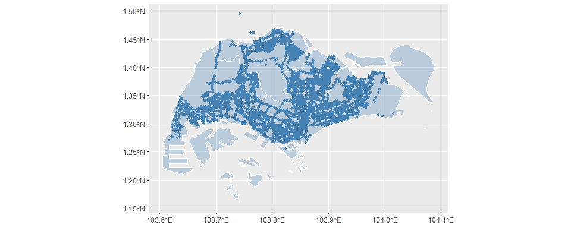
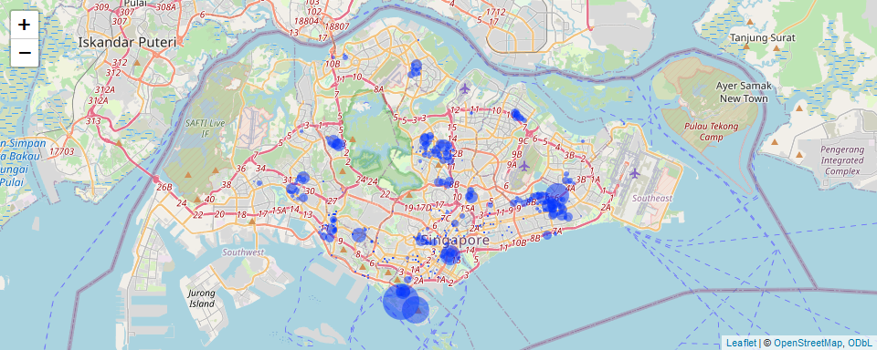
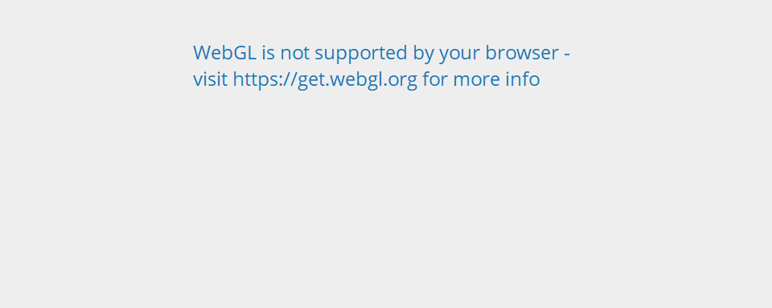
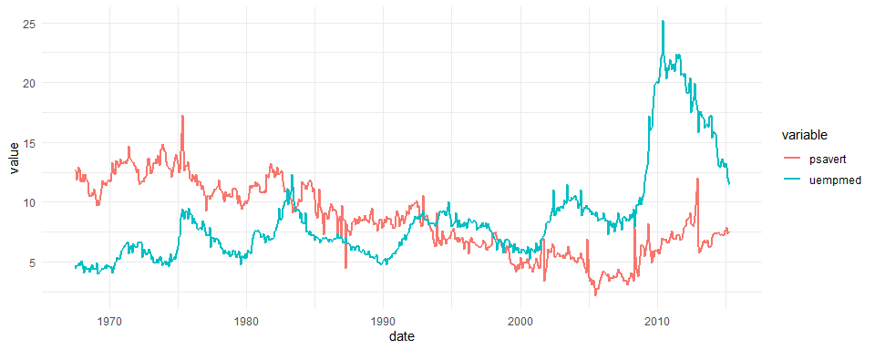
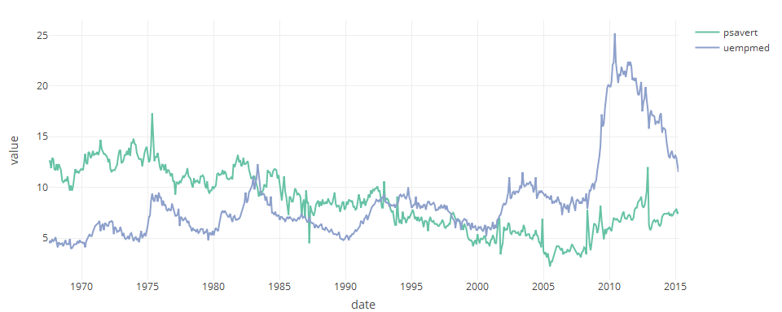
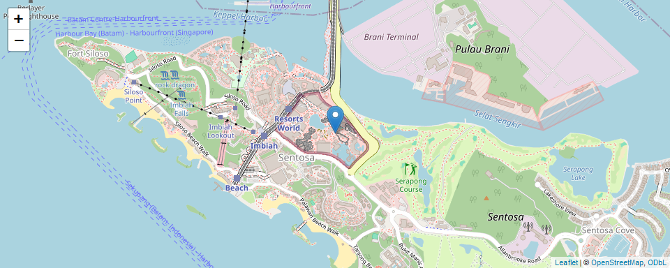
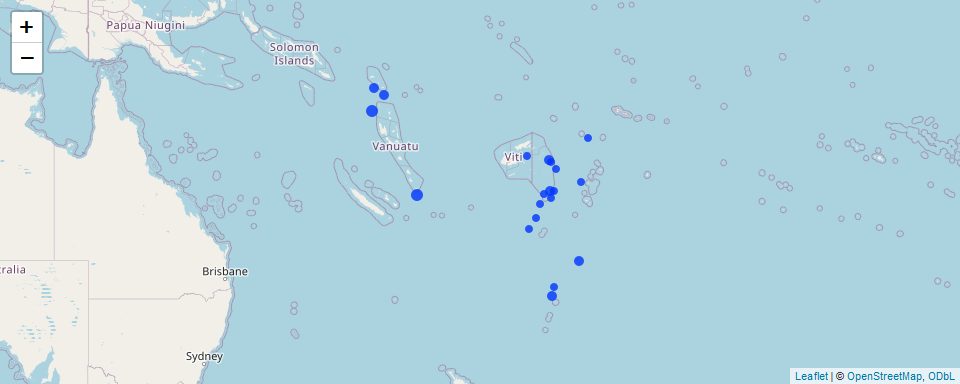

Workshop 6
================
YH
2024-02-19

- [Interactive visualizations](#interactive-visualizations)
- [Workshop: Real-time Carpark
  Availability](#workshop-real-time-carpark-availability)

## Interactive visualizations

So far, we’ve been creating static plots in `R`. Now let’s move to
interactive visuals.

We will use two packages: `plotly` and `leaflet`.

``` r
# install.packages(c("plotly", leaflet"))
library(plotly)
library(leaflet)
library(tidyverse)
```

### `plotly` scatter plot

`plotly` is a software that provides open-source APIs for creating
interactive visualizations. It is available in `R`, `python`, Matlab,
and Javascript.

With the package loaded, we can convert `ggplot` objects easily into
interactive graphics.

Let’s start from a static plot.

``` r
data(iris)
p1 <- ggplot(data =iris,aes(x =Sepal.Width,y =Petal.Width,color =Species)) +
  geom_point()
p1
```

<!-- -->

Convert it into interactive visual.

``` r
ggplotly(p1)
```

<!-- -->

We can also use `plotly`’s own function, `plot_ly()` to build
interactive graphics.

``` r
plot_ly(
  data = iris,
  x = ~Sepal.Width, y = ~Petal.Width, color = ~Species,
  type = "scatter", # Specify the type of plot to create
  mode = "markers" # Determine the drawing mode for the scatter (point markers)
) %>%
  layout(
    title = "Iris data set visualization",
    xaxis = list(title = "Sepal width", ticksuffix = "cm"),
    yaxis = list(title = "Petal width", ticksuffix = "cm")
  )
```

<!-- -->

Here is a 3D scatter plot by `plot_ly()`.

``` r
plot_ly(
  data = iris, 
  x= ~Sepal.Length, y= ~Sepal.Width, z= ~Petal.Length, color = ~Species,
  type = "scatter3d",
  mode = "markers") 
```

<!-- -->

### `plotly` time series plot

For visualization of multiple time series, it is useful to include
annotations or hover tools.

Let’s create a static plot on `psavert`, personal savings rate, and
`unemploy`, the number of unemployed in thousands.

``` r
data(economics_long)
economics_long %>%
  filter(variable %in% c("psavert", "uempmed")) %>%
  ggplot(aes(x = date, y = value, color = variable)) +
  geom_line(lwd = 1) +
  theme_minimal()
```

<!-- -->

An interactive plot with hover tools:

``` r
df <- economics_long %>%
  filter(variable %in% c("psavert", "uempmed"))
plot_ly(
  data = df, 
  x= ~date, y= ~value, color = ~variable,
  type = "scatter",
  mode = "lines") %>%
  # Unified hovermode
  layout(hovermode = "x unified")
```

<!-- -->

### The `leaflet` package

`leaflet` is an open-source JavaScript library for interactive maps.

- We can use it through the `leaflet` package in `R`.

The following code pin-points a single location in Singapore.

- The `addMarkers` calls out point(s) on the map.

``` r
leaflet() %>%
  addTiles() %>%
  addMarkers(lng = 103.8238, lat = 1.2540, popup = "Universal Studio Singapore")
```

<!-- -->

We can specify multiple pairs of latitude/longitude coordinates.

``` r
# Load data
data(quakes)
# Show the first 20 lines on the map
leaflet(quakes[1:20, ]) %>%
  addTiles() %>%
  addMarkers(lng = ~long, lat = ~lat, 
             popup = ~paste0("Magnitude: ", mag))
```

<!-- -->

We can replace the location pins as circle markers via
`addCircleMarkers()`.

``` r
# Show the first 20 lines on the map
leaflet(quakes[1:20, ]) %>%
  addTiles() %>%
  addCircleMarkers(lng = ~long, lat = ~lat,
                   popup = ~paste0("Magnitude: ", mag),
                   radius = ~mag, stroke = FALSE, fillOpacity = 0.8)
```

<!-- -->

## Workshop: Real-time Carpark Availability

Let’s visualize the carpark availability data from LTA.

``` r
library(httr); library(jsonlite)
# Construct the resource URL
resource_url <- "http://datamall2.mytransport.sg/ltaodataservice/CarParkAvailabilityv2"
# Make the GET() request
res <- GET(resource_url, 
           add_headers(AccountKey = Sys.getenv("LTA_KEY"),
                       accept = "application/json"))
# Parse the returned data
res_content <- content(res, as = "text")
res_list <- fromJSON(res_content, flatten = TRUE)
# Extract information from sub-list
df_carpark <- as_tibble(res_list$value)
head(df_carpark)
```

<div class="kable-table">

| CarParkID | Area   | Development        | Location          | AvailableLots | LotType | Agency |
|:----------|:-------|:-------------------|:------------------|--------------:|:--------|:-------|
| 1         | Marina | Suntec City        | 1.29375 103.85718 |           621 | C       | LTA    |
| 2         | Marina | Marina Square      | 1.29115 103.85728 |           866 | C       | LTA    |
| 3         | Marina | Raffles City       | 1.29382 103.85319 |           167 | C       | LTA    |
| 4         | Marina | The Esplanade      | 1.29011 103.85561 |           580 | C       | LTA    |
| 5         | Marina | Millenia Singapore | 1.29251 103.86009 |           390 | C       | LTA    |
| 6         | Marina | Singapore Flyer    | 1.28944 103.86311 |           228 | C       | LTA    |

</div>

``` r
# Extract information from sublist
df_carpark <- as_tibble(res_list$value) %>%
  separate(Location, into = c("lat", "long"), sep = " ", convert = TRUE)

leaflet(df_carpark) %>%
  addTiles() %>%
  addCircleMarkers(lng = ~long, lat = ~lat,
             popup = ~paste0("Available slots: ", AvailableLots),
             radius = ~AvailableLots/100, stroke = FALSE, fillOpacity = 0.5)
```

<!-- -->
